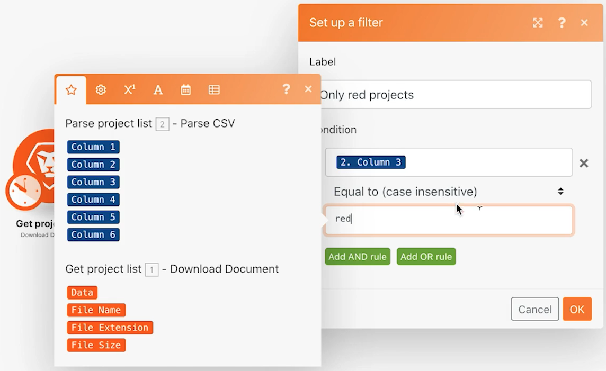

# フィルター

モジュール間のフィルターを使用して、特定の種類のバンドルのみを許可する方法を説明します。

## 演習の概要

Beyond basic mapping シナリオで 2 つのモジュール間にフィルターを追加して、CSV ファイル内に「赤」のプロジェクト色を持つプロジェクトのみを作成します。

## 従う手順

1. 「基本的なマッピングを超えた」シナリオのクローンを作成し、「強力なフィルターの使用」という名前を付けます。

   **赤いプロジェクトのみを作成できるように、Workfrontプロジェクト作成モジュールの前にフィルターを追加します。**

   

1. フィルターを追加するには、モジュール間を結ぶ点線をクリックするか、レンチをクリックし、「フィルターを設定する」を選択します。
1. 「ラベル」フィールドを使用して、フィルターに「Only Red Projects」という名前を付けます。
1. 「条件」フィールドで、「プロジェクトの色」フィールド（CSV ファイルの列 3）をマッピングします。 次と等しい（大文字と小文字を区別しない）演算子を選択し、「赤」と入力します。
1. 「OK」をクリックします。

   

   **フィルターをテストし、結果を確認します。**

1. 「保存」をクリックしてシナリオを保存し、「1 回実行」をクリックします。
1. フィルターの実行インスペクターをクリックして、各バンドルがフィルターによってどのように調べられ、Workfrontプロジェクトの作成モジュールに渡されたか、移動できなかったかを確認します。

   

1. Workfrontインスタンスで作成したプロジェクトを見つけます。
