# 最初のシナリオデザインの演習

Workfront Fusion に初めてログインする際の基本的な操作方法と、最初のシナリオの作成について説明します。

## 前提条件

1. この演習には、Workfront 体験版ドライブが必要です。 [このフォーム](https://forms.office.com/r/f1J8HRGrNY)に入力してリクエストできます。 フォームにアクセスできない場合は、名前、メールアドレス、会社名を wfttstdr@adobe.com に送信してください。
1. Fusion の演習では、この演習に対応するチュートリアルビデオを視聴したことを前提としています。 ここでは、[最初のシナリオデザインのチュートリアル](https://experienceleague.adobe.com/docs/workfront-learn/tutorials-workfront/fusion/understand-the-basics/initial-scenario-design-walkthrough.html?lang=ja)を指します。

## 演習の概要

Workfront で、プロジェクトリストの CSV ファイルの各レコードに対して新しいプロジェクトを作成します。

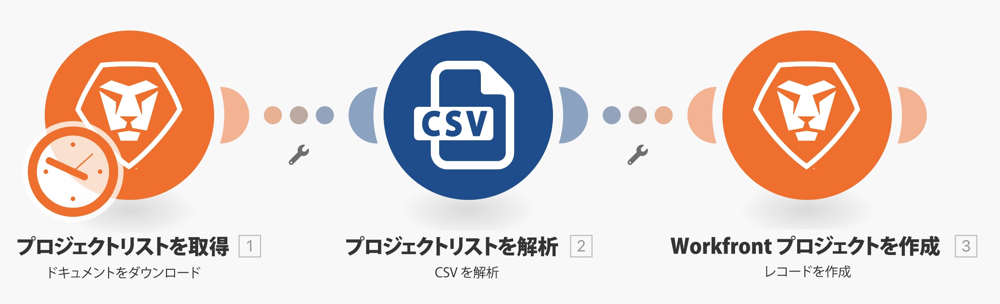

## 手順

1. 「Fusion 活用練習」という名前のフォルダーを「シナリオ」セクションに作成します。
1. フォルダー内をクリックし、「新しいシナリオを作成」をクリックします。

   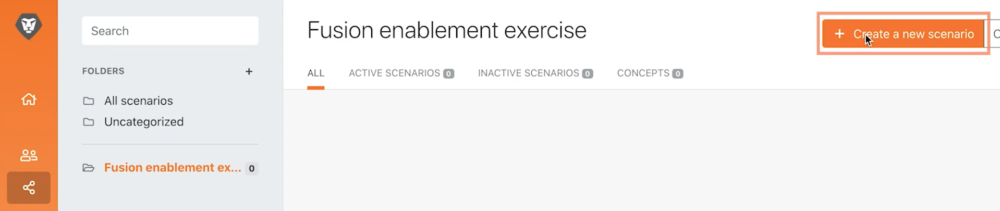

1. 次のページで、「Workfront」を検索してアプリを選択します。 「続行」をクリックします。
1. シナリオ designer 画面の左上で、シナリオの名前を「最初のシナリオのデザイン」に変更します。
1. 画面の中央にある空のトリガーモジュールをクリックし、Workfront アプリを選択して、「ドキュメントをダウンロード」モジュールを選択します。

   **モジュールの Workfront アカウントへの接続を認証します。**

1. Workfront インスタンスに接続する前に、最初にそのWorkfront インスタンスでOAuth 2.0 コネクタを作成する必要があります。 このログインをWorkfront インスタンスに行うには、**セットアップ/システム/OAuth2 アプリケーション**&#x200B;に移動し、**アプリケーション統合の作成**&#x200B;をクリックします。

   以下に示すように、フォームの最初のページに入力し、**作成**&#x200B;をクリックします。

   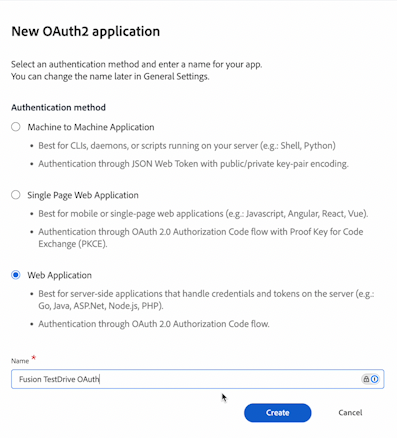

1. 次の画面が表示されたら、**リダイレクト URL** フィールドに次のURLを入力します。

   `https://app.workfrontfusion.com/oauth/cb/workfront-workfront`

   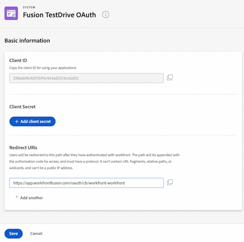

1. 次に、「**クライアントシークレットを追加**」ボタンをクリックします。 クライアントシークレットが表示されます。 コピーして、後の手順で取り出せる場所に保存します。 Fusion シナリオで必要になります。 また、今後の手順のために&#x200B;**クライアント ID**&#x200B;をコピーして保存します。 これらのコピーが完了したら、アプリケーションの下部にある&#x200B;**保存**&#x200B;をクリックします。

   

1. Fusionに戻り、「**Add**」ボタンをクリックして、Workfrontとのつながりを構築します。

   

1. 接続タイプとして「**Adobe Workfront認証**」を選択し、**詳細設定を表示** ボックスにチェックを入れます。 次に、**続行**&#x200B;をクリックします。

   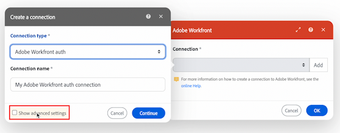

1. ここで入力するには、**クライアント ID**&#x200B;と、以前に保存した&#x200B;**クライアントシークレット**&#x200B;を使用します。 **認証URL**&#x200B;の場合、フィールドの下に指定されたデフォルトの認証URLをコピーし、`oauth.my`を`<domain name>.testdrive`に置き換え、**続行**&#x200B;をクリックするのが最も簡単です。

   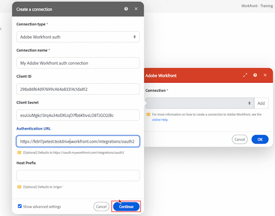

1. 接続は認証中である必要があります。 Workfrontへのログインが必要な場合があります。 クリック **アクセスを許可**。

   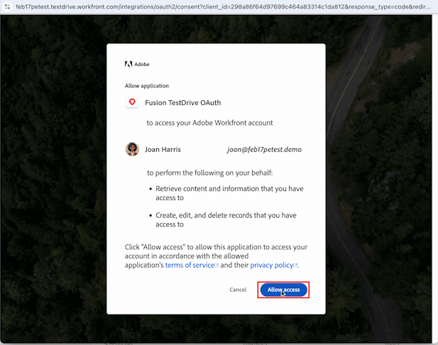

   **接続が確立されました。 次に、Workfront からダウンロードするドキュメントのドキュメント ID を入力します。**

   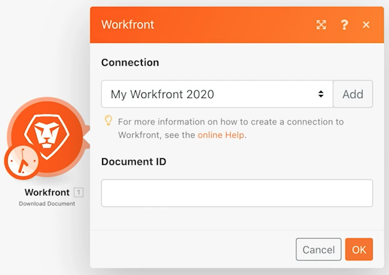

1. Workfront に戻ります。 「Fusion 練習ファイル」フォルダーで、「_Fusion2020_Project List.csv」を選択し、左パネルの「ドキュメントの詳細」をクリックします。 URL アドレスからドキュメント ID 番号をコピーします（URL 内の最初の長い番号です）。

   

1. Fusion に戻り、「ドキュメント ID」フィールドに番号を貼り付け、「OK」をクリックします。
1. モジュールの名前は、作成した際に変更するのがベストプラクティスです。 Workfront モジュールを右クリックして「名前を変更」を選択します。 モジュールに「プロジェクトリストを取得」という名前を付けます。

   **次に、ダウンロードした CSV ファイルを解析し、ファイルの各レコードにアクセスできるようにします。 この情報は、各レコードからプロジェクトを作成する際に使用します。**

1. 別のモジュールを追加するには、Workfront モジュールの右側をクリックします。 CSV アプリを検索し、「CSV を解析」モジュールを選択します。
1. 「CSV を解析」を 6 列、CSV にヘッダーを含む、コンマ区切りタイプに設定し、CSV フィールドにデータを入力します。 「OK」をクリックします。

   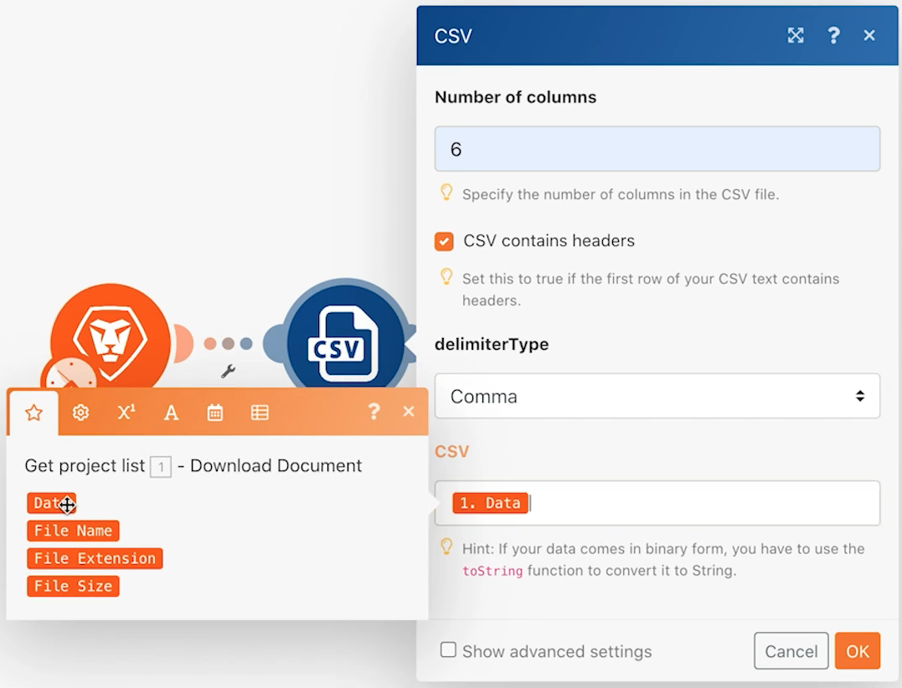

1. このモジュールの名前を「プロジェクトリストを解析」に変更します。
1. シナリオ designer の下部で「保存」をクリックして、シナリオを保存します。
1. 「1 回実行」をクリックして出力を表示します。

   >[!NOTE]
   >
   >「変換サービスを最後のモジュールにすべきでない」という警告を無視します（これは正しいですが、このテストでは問題になりません）。 「実行」をクリックします。

   

1. 「CSV を解析」モジュールで実行インスペクターを開き、モジュールの入力と出力を確認します。 入力として 1 つのバンドル（CSV ファイル）、出力として複数のバンドル（CSV ファイルの各レコードに 1 つのバンドル）があります。 次のようになります。

   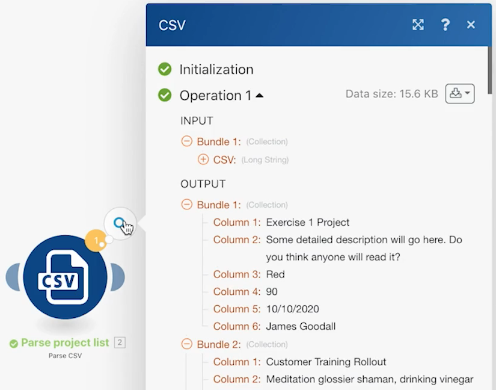

   **モジュールを追加して、CSV ファイルの各レコードのプロジェクトを作成します。**

1. 別のモジュールを追加します。 Workfront アプリを選択し、「レコードを作成」モジュールを選択します。
1. 「レコードタイプ」を「プロジェクト」に設定します。

   >[!TIP]
   >
   >*proj* のようにいくつかの文字を入力して検索し、その右へ移動します。

1. 次に、Cmd + G または Ctrl + G キーを使用して名前（プロジェクト名）を検索します。 「名前」の横のチェックボックスをオンにします。フィールドが下に表示されます。
1. 「予定開始日」と「優先度」の横にあるチェックボックスをオンにします。
1. 「名前」フィールドをクリックすると、マッピングパネルが表示されます。 「CSV を解析」モジュールの「列 1」フィールドをクリックして、「名前」フィールドに追加します。 CSV ファイルのプロジェクト名です。
1. 「予定開始日」で、「CSV を解析」モジュールの「列 5」をクリックします。
1. 「優先度」で、ドロップダウンメニューから「標準」を選択します。

   **マッピングパネルは次のようになります。**

   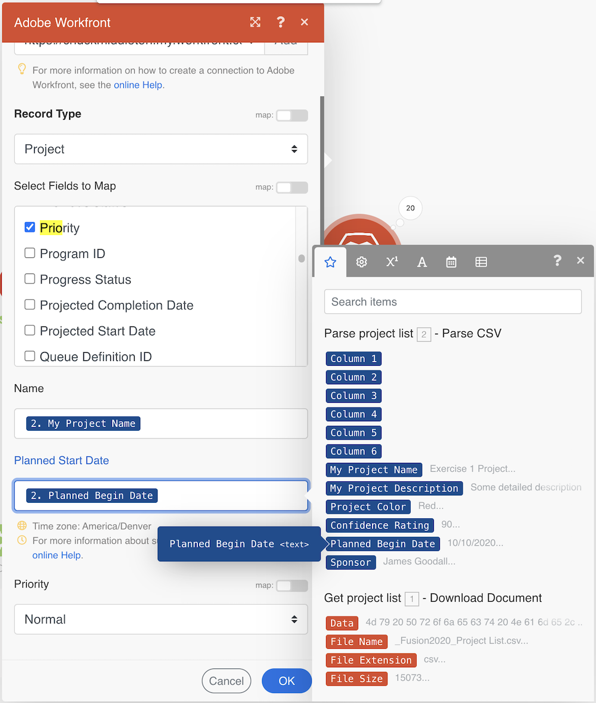

1. 「OK」をクリックします。

   >[!NOTE]
   >
   >「OK」をクリックせずに誤って「戻る」をクリックして designer に戻った場合は、作業内容は保存されていないため、再度マッピングする必要があります。

1. Workfront モジュールを右クリックし、名前を「Workfront プロジェクトの作成」に変更します。
1. シナリオを保存し、「1 回実行」ボタンをクリックします。
1. 最後のモジュールの右上にある実行インスペクターをクリックします。

   + 20 個の操作が実行されます。 各操作では、CSV ファイルから 1 つのバンドル（つまり 1 レコード）を入力として取得し、Workfront で作成されたプロジェクトである 1 つのバンドルを出力しました。 作成したプロジェクトのプロジェクト ID が出力バンドルと共に表示されます。

   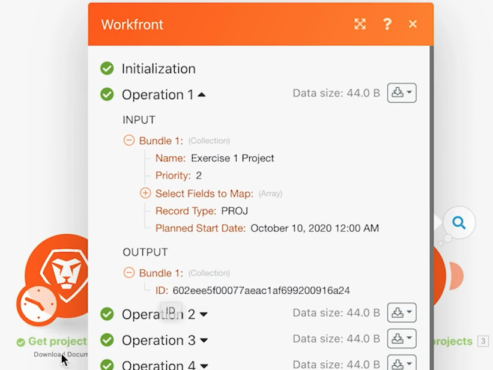

   **メモの使用**

1. メモは、シナリオのデザインをより明確に把握するのに役立ちます。 「Workfront プロジェクトを作成」モジュールにメモを追加するには、右クリックして「メモを追加」を選択します。 Designer ウィンドウの右側にあるパネルがポップアウト表示され、モジュールにメモを追加できます。 「CSV ファイルからマッピングされた名前、予定開始日、優先度を使用してプロジェクトを作成します。」と入力します。
1. トリガーモジュール（最初の Workfront モジュール）が何をしているかを説明するメモも追加します。
1. メモパネルを閉じるには、右上隅の X をクリックします。

   + メモに再度アクセスするには、下部のツールバーのメモボタンをクリックするか、モジュールを右クリックして新しいメモを追加します。
   + メモは時系列の逆順に並べ替えられます。
   + メモを追加すると「メモ」ボタンにオレンジ色の点が表示されます。

   

1. コントロールツールバーの「保存」ボタンをクリックして、シナリオを保存します。
1. Workfront インスタンスで作成したプロジェクトを表示できます。
