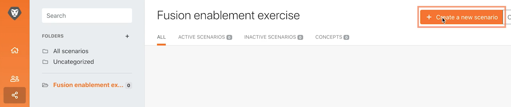

# 最初のシナリオのデザイン

Workfront Fusion に初めてログインする際の基本的な操作方法と、最初のシナリオの作成について説明します。

## 演習の概要

Workfront で、プロジェクトリストの CSV ファイルの各レコードに対して新しいプロジェクトを作成します。

## 手順

1. 「Fusion 活用練習」という名前のフォルダーを「シナリオ」セクションに作成します。
1. フォルダー内をクリックし、「新しいシナリオを作成」をクリックします。

   

1. 次のページで、「Workfront」を検索してアプリを選択します。「続行」をクリックします。
1. シナリオデザイナー画面の左上で、シナリオの名前を「最初のシナリオのデザイン」に変更します。
1. 画面の中央にある空のトリガーモジュールをクリックし、Workfront アプリを選択して、「ドキュメントをダウンロード」モジュールを選択します。

   **モジュールの Workfront アカウントへの接続を認証します。**

1. 接続を初めて作成する場合は、「追加」ボタンをクリックします。

   

1. 接続に名前を付けます（「My Workfront 2020」など）。

   

1. Workfront インスタンスの URL を入力し、「次へ」をクリックします。

   

1. パスワードを入力して「ログイン」をクリックします。

   **接続が確立されました。次に、Workfront からダウンロードするドキュメントのドキュメント ID を入力します。**

   

1. Workfront に戻ります。「Fusion 練習ファイル」フォルダーで、「_Fusion2020_Project List.csv」を選択し、左パネルの「ドキュメントの詳細」をクリックします。 URL アドレスからドキュメント ID 番号をコピーします（URL 内の最初の長い番号です）。

   

1. Fusion に戻り、「ドキュメント ID」フィールドに番号を貼り付け、「OK」をクリックします。
1. モジュールの名前は、作成した際に変更するのがベストプラクティスです。Workfront モジュールを右クリックして「名前を変更」を選択します。モジュールに「プロジェクトリストを取得」という名前を付けます。

   **次に、ダウンロードした CSV ファイルを解析し、ファイルの各レコードにアクセスできるようにします。この情報は、各レコードからプロジェクトを作成する際に使用します。**

1. 別のモジュールを追加するには、Workfront モジュールの右側をクリックします。CSV アプリを検索し、「CSV を解析」モジュールを選択します。
1. 「CSV を解析」を 6 列、CSV にヘッダーを含む、コンマ区切りタイプに設定し、CSV フィールドにデータを入力します。「OK」をクリックします。

   

1. このモジュールの名前を「プロジェクトリストを解析」に変更します。
1. シナリオデザイナーの下部で「保存」をクリックして、シナリオを保存します。
1. 「1 回実行」をクリックして出力を表示します。

   >[!NOTE]
   >
   >「変換サービスを最後のモジュールにすべきでない」という警告を無視します（これは正しいですが、このテストでは問題になりません）。「実行」をクリックします。

   

1. 「CSV を解析」モジュールで実行インスペクターを開き、モジュールの入力と出力を確認します。入力として 1 つのバンドル（CSV ファイル）、出力として複数のバンドル（CSV ファイルの各レコードに 1 つのバンドル）があります。次のようになります。

   

   **モジュールを追加して、CSV ファイルの各レコードのプロジェクトを作成します。**

1. 別のモジュールを追加します。Workfront アプリを選択し、「レコードを作成」モジュールを選択します。
1. 「レコードタイプ」を「プロジェクト」に設定します。

   >[!TIP]
   >
   >*proj* のようにいくつかの文字を入力して検索し、その右へ移動します。

1. 次に、Cmd + G または Ctrl + G キーを使用して名前（プロジェクト名）を検索します。「名前」の横のチェックボックスをオンにします。フィールドが下に表示されます。
1. 「予定開始日」と「優先度」の横にあるチェックボックスをオンにします。
1. 「名前」フィールドをクリックすると、マッピングパネルが表示されます。「CSV を解析」モジュールの「列 1」フィールドをクリックして、「名前」フィールドに追加します。CSV ファイルのプロジェクト名です。
1. 「予定開始日」で、「CSV を解析」モジュールの「列 5」をクリックします。
1. 「優先度」で、ドロップダウンメニューから「標準」を選択します。

   **マッピングパネルは次のようになります。**

   

1. 「OK」をクリックします。

   >[!NOTE]
   >
   >「OK」をクリックせずに誤って「戻る」をクリックしてデザイナーに戻った場合は、作業内容は保存されていないため、再度マッピングする必要があります。

1. Workfront モジュールを右クリックし、名前を「Workfront プロジェクトの作成」に変更します。
1. シナリオを保存し、「1 回実行」ボタンをクリックします。
1. 最後のモジュールの右上にある実行インスペクターをクリックします。

   + 20 個の操作が実行されます。各操作では、CSV ファイルから 1 つのバンドル（つまり 1 レコード）を入力として取得し、Workfront で作成されたプロジェクトである 1 つのバンドルを出力しました。作成したプロジェクトのプロジェクト ID が出力バンドルと共に表示されます。

   

   **メモの使用**

1. メモは、シナリオのデザインをより明確に把握するのに役立ちます。 「Workfront プロジェクトを作成」モジュールにメモを追加するには、右クリックして「メモを追加」を選択します。デザイナーウィンドウの右側にあるパネルがポップアウト表示され、モジュールにメモを追加できます。「CSV ファイルからマッピングされた名前、予定開始日、優先度を使用してプロジェクトを作成します。」と入力します。
1. トリガーモジュール（最初の Workfront モジュール）が何をしているかを説明するメモも追加します。
1. メモパネルを閉じるには、右上隅の X をクリックします。

   + メモに再度アクセスするには、下部のツールバーのメモボタンをクリックするか、モジュールを右クリックして新しいメモを追加します。
   + メモは時系列の逆順に並べ替えられます。
   + メモを追加すると「メモ」ボタンにオレンジ色の点が表示されます。

   

1. コントロールツールバーの「保存」ボタンをクリックして、シナリオを保存します。
1. Workfront インスタンスで作成したプロジェクトを表示できます。
