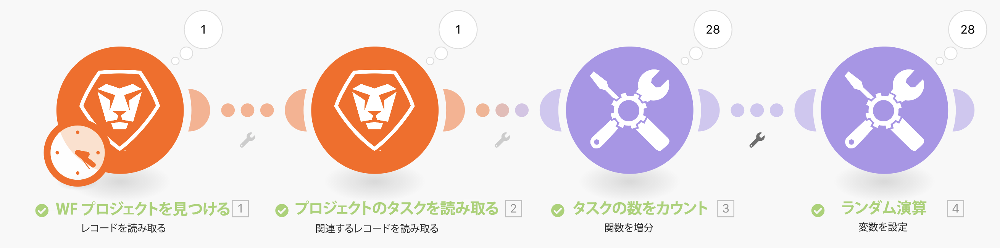

# イテレータ演習の概要

イテレーションタイプのアプリの使用方法と、情報の各バンドルでアクションを実行する方法について説明します。

## 演習の概要

Workfront で特定のプロジェクトを確認してから、そのプロジェクト内のすべてのタスクを確認します。増分ツールモジュールを使用して、プロジェクト内のタスクの数をカウントします。最後に、変数を設定モジュールを使用して、未完了のイシューの数から子の数を減算し、各タスクバンドルの数値を生成します。

## 手順

**プロジェクトおよび関連タスクを読み取ります。**

1. 新しいシナリオを開始します。「イテレーションの概要」という名前を付けます。
1. トリガーモジュールとして「Workfront」を選択し、レコードを読み取ります。
1. レコードタイプで、「プロジェクト」を選択します。
1. 出力で、「ID」、「名前」および「説明」を選択します。
1. 「ID」フィールドに、Workfront の体験版インスタンスからの Northstar Fashion Exhibitors Booth プロジェクトのプロジェクト ID を入力します。
1. このモジュールの名前を「WF プロジェクトを検索」に変更します。
1. 別の Workfront モジュールを追加して、このプロジェクトに関連するタスクを読み取ります。関連レコードを読み取りモジュールを選択します。
1. レコードタイプで、「プロジェクト」を選択します。
1. 親レコード ID で、レコードを読み取りモジュールから ID を選択します。
1. コレクションで、「タスク」を選択します。
1. 出力で、「ID」、「名前」、「説明」、「子の数」、「未完了のイシューの数」および「作業」を選択します。
1. このモジュールの名前を「プロジェクトのタスクを読み取り」に変更します。
1. シナリオを保存し、「1 回実行」をクリックして出力を表示します。

   + 実行インスペクターをクリックすると、1 つのバンドルが入力（プロジェクト）として表示され、28 個のバンドルが出力（タスク）として表示されます。

   **イテレーションバンドルをカウントして処理します。**

1. 関連レコードを読み取りの後に別のモジュールを追加します。増分関数ツールモジュールを選択します。

   + 「値をリセット」フィールドはなしのままにし、「OK」をクリックします。

1. このモジュールの名前を「タスクの数をカウント」に変更します。
1. 変数を設定モジュールを追加します。変数名を「ランダム計算」に設定します。
1. 「変数」値フィールドで、開いている opTask の数から開いている子の数を引きます。

   **次のようになります。**

   

1. このモジュールの名前を「ランダム計算」に変更します。
1. シナリオを保存し、「1 回実行」をクリックします。

関連レコードを読み取りイテレータモジュールによって作成されたタスクごとに、Workfront Fusion は 28 回の実行を実行しました。これらの 28 個のバンドルは、ループを閉じるためにアグリゲータが追加されない限り、シナリオ全体で引き続き処理されます。
