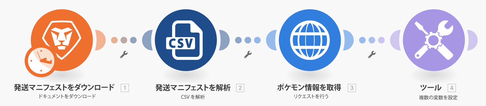

# ユニバーサルコネクタの概要の演習

REST ユニバーサルコネクタの操作と、返されるデータの操作に関する理解を深めます。

## 演習の概要

スプレッドシートでポケモンのキャラクターを使用して、HTTP コネクタを介して Poke API を呼び出し、そのキャラクターに関する詳細を収集して投稿します。

## 手順

**Workfront から CSV ファイルをダウンロードします。**

1. Workfront の「Fusion Exersice Files」フォルダーで「_Fusion2020_Shipping Manifest.csv」を選択し、「ドキュメントの詳細」をクリックします。
1. URL アドレスから最初の ID 番号をコピーします。
1. Workfront Fusion で新しいシナリオを作成します。これに「ユニバーサルコネクタの使用」という名前を付けます。
1. まず、Workfront アプリから「ドキュメントをダウンロード」モジュールを起動します。
1. Workfront 接続を設定し、Workfront URL からコピーしたドキュメント ID を含めます。
1. このモジュールの名前を「出荷マニフェストをダウンロード」に変更します。

   

   **出荷マニフェストのデータを解析します。**

1. 「CSV を解析」を選択して、別のモジュールを追加します。
1. 11 列用に「CSV を解析」を設定します。「CSV にヘッダーを含む」ボックスをオンにします。「コンマ区切りタイプ」を選択し、「ドキュメントをダウンロード」モジュールのデータを「CSV」フィールドに入力します。

   

1. このモジュールの名前を「出荷マニフェストを解析」に変更します。
1. シナリオを保存して「1 回実行」をクリックすると、次の手順で CSV ファイルのデータを確認できます。

   **ユニバーサルコネクタを使用してポケモンデータを手に入れます。**

1. 「HTTP リクエストを行う」モジュールを追加します。
1. URL フィールドで `https://pokeapi.co/api/v2/pokemon/[Character]` を使用します。[キャラクター]は「CSVを解析」モジュールの列 3 にマッピングされます。
1. 「応答を解析」チェックボックスを選択します。
1. 「詳細設定を表示」を選択し、「すべての状態をエラーとして評価」の横にあるチェックボックスをオンにします。
1. 「OK」をクリックし、モジュールの名前を「ポケモン情報の取得」に変更します。

   **マッピングパネルは次のようになります。**

   

   **演習のこの部分では、CSV ファイルの行 1 のみを処理します。**

1. 「ポケモン情報の取得」モジュールの前にフィルターを追加します。「1 行目のみ」という名前を付けます。
1. ID 番号 1 のみを渡す条件を設定します。ID 番号 1 が 1 行目に、ID フィールドが CSV ファイルの列 1 に入っています。

   

1. シナリオを保存します。
1. 「1 回実行」をクリックし、「HTTP リクエストを行う」モジュールで受け取るエラーメッセージを確認します。

   >[!IMPORTANT]
   >
   >入力データ URL フィールドでは、キャラクター名が大文字であることに注意が必要です。キャラクター名は小文字にする必要があるので、この API 呼び出しを行うためには機能しません。

   

1. 「HTTP リクエストを行う」URL フィールドのマッピングパネルで、**lower** 関数を使用して「[キャラクター]」フィールドをすべて小文字にします。

   

   **「複数の変数を設定」モジュールを使用して、API から情報をマッピングし直します。**

1. 「ポケモン情報の取得」の後に「複数の変数を設定」モジュールを追加します。名前、高さ、重み、能力をマッピングします。
1. 「能力」フィールドは配列なので、map 関数を使用して配列内の各能力名にアクセスする必要があります。

   

   **別のエラーを明らかにするには、フィルターを使用せずにシナリオを実行します。**

1. CSV ファイル内のすべての行を処理するには、行 1 のみという名前のフィルターを削除します。

   + フィルターアイコンをクリックして編集します。
   + フィルターラベルを削除します。
   + 条件を削除します。
   + 「OK」をクリックします。

1. シナリオを保存し、「1 回実行」をクリックします。
1. ポケモン情報を取得モジュールでエラーが発生しました。スーパーヒーローキャラクターが Pokemon API に渡されているのを確認します。

   >[!NOTE]
   >
   >ルーターのチュートリアルでは、スーパーヒーローを処理するための別のパスを作成して、このエラーを解決する方法を確認できます。

   
