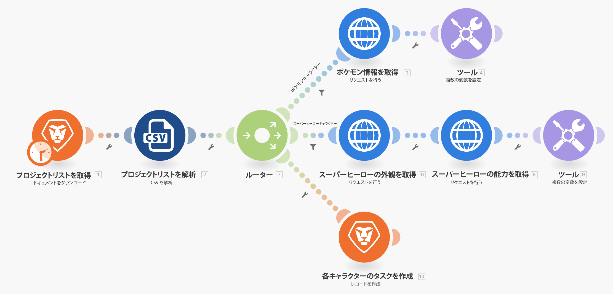
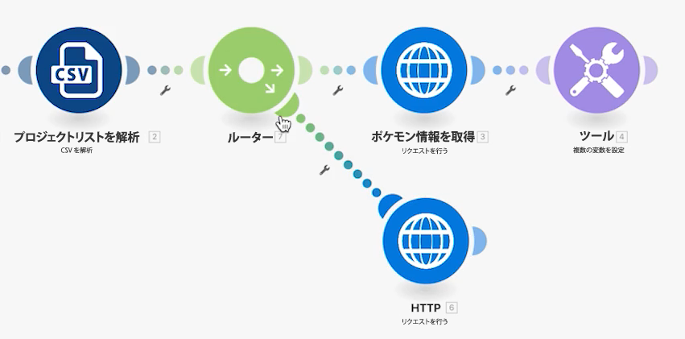
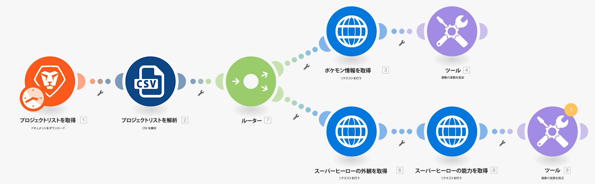
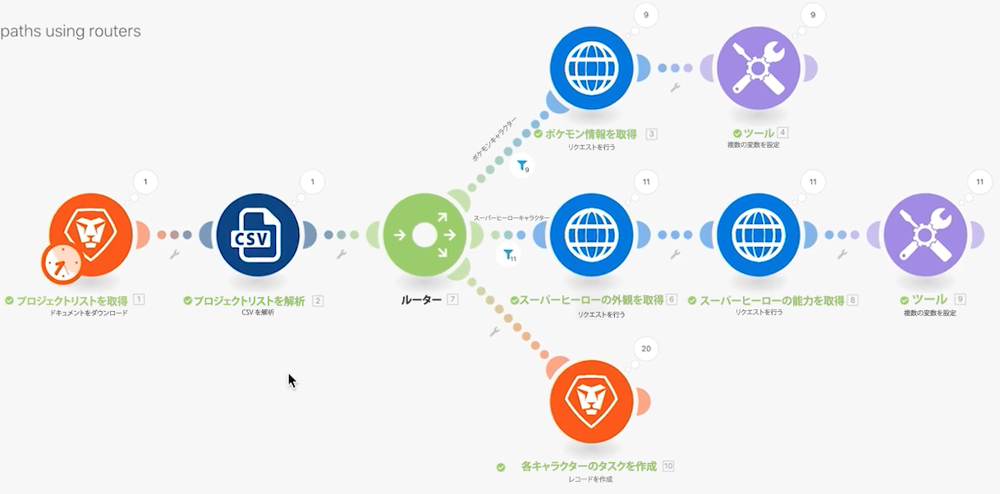

# ルーターの演習

ルーターの重要性と、異なるモジュールを条件付きで処理するためにルーターを使用する方法を理解します。

## 演習の概要

ルーターを使用して、正しいパスにポケモンとスーパーヒーローのバンドルを渡し、各キャラクターのタスクを作成します。

## 手順

1. 前の演習から、ユニバーサルコネクタを使用するシナリオを複製します。「ルーターを使用して様々なパスを作成」という名前を付けます。

   **モジュールを複製してルーターを追加し、スーパーヒーローの新しいパスを作成します。**

   

1. 「ポケモン情報を手に入れる」モジュールを右クリックし、「複製」を選択します。複製したら、新しい HTTP モジュールと「CSV を解析」モジュールの間の行にドラッグして接続します。

   >[!NOTE]
   >
   > 2 つのパスを持つルーターが自動的に追加されることがわかります。

1. このモジュールに「スーパーヒーローの姿を手に入れる」という名前を付けます。
1. このモジュールを複製し、複製を右に移動し、「スーパーヒーローの能力を手に入れる」という名前を付けます。
1. ツールモジュールを複製し、2 番目のパスの最後に移動します。
1. ツールバーの杖のアイコン（自動整列ボタン）をクリックします。

   **シナリオは次のようになります。**

   

   **次に、新しく複製されたモジュールでマッピングされた値を変更します。**

1. <https://www.superheroapi.com/> に移動し、facebook アカウントを使用してアクセストークンを取得します。

   >[!NOTE]
   >
   >独自のスーパーヒーロートークンへのアクセスで問題が発生した場合は、共有トークン「10110256647253588」を使用できます。スーパーヒーロー API の呼び出し回数に気を配って、この共有トークンが引き続き全員に対して機能するようにしてください。

1. 「スーパーヒーローの姿を手に入れる」設定を開き、URL を `https://www.superheroapi.com/api/[access- token]/332/appearance` に変更します。必ず URL にアクセストークンを含めてください。「OK」をクリックします。
1. 「スーパーヒーローの能力を手に入れる」設定を開き、URL を `https://www.superheroapi.com/api/[access- token]/332/powerstats` に変更します。必ず URL にアクセストークンを含めてください。「OK」をクリックします。
1. 各スーパーヒーローモジュールを右クリックし、「このモジュールのみ実行」を選択します。これにより、マッピングに必要なデータ構造が生成されます。
1. 両方を実行した後、各 URL フィールドの数値「332」を、「CSV を解析」モジュールからマッピングされた列 4 に変更します。

   

   **これで、スーパーヒーローのパスの「複数の変数を設定」モジュールをクリックして、名前、高さ、重さ、能力を更新できます。**

1. 「スーパーヒーローの能力を手に入れる」モジュール（モジュール 8）の「名前」フィールドと「能力」フィールドを更新します。

   

1. 「スーパーヒーローの姿を手に入れる」モジュール（モジュール 6）の高さフィールドと重さフィールドを更新します。

   

   **完了したら、変数は次のようになります。モジュール番号は、フィールド値** に表示されます。

   

1. 「OK」をクリックして、シナリオを保存します。

   **別のパスを作成して、キャラクターごとにタスクを作成します。**

1. Workfront で、空のプロジェクトを作成します。「出荷計画プロジェクト」という名前を付け、URL からプロジェクト ID をコピーします。
1. Workfront Fusion に戻り、ルーターの中央をクリックして別のパスを作成します。

   

1. 表示される空のモジュールの中央をクリックし、Workfront アプリから「レコードを作成」モジュールを追加します。
1. レコードのタイプをタスクに設定し、プロジェクト ID を「フィールドからマップへ」セクションで選択します。
1. Workfront からコピーしたプロジェクト ID をプロジェクト ID フィールドにペーストします。
1. 次に、「フィールドからマップへ」セクションで名前フィールドを選択します。
1. CSV ファイルからキャラクター名とフランチャイズ名を取り出し、タスクに「[フランチャイズ]の[キャラクター]」と入力します。列 3 はキャラクター名、列 2 はフランチャイズ名です。

   

1. 「OK」をクリックし、このモジュールの名前を「各キャラクターのタスクを作成する」に変更します。

   **エラーなくシナリオが実行されるようにフィルターを追加します。 ポケモンキャラクターだけを上のパスに、スーパーヒーローキャラクターだけを中央のパスに、すべてのキャラクターを下のパスに移動させるとします。**

1. ポケモン情報を取得モジュールの左側の点線をクリックして、第一のフィルターを作成します。 「ポケモンキャラクター」という名前を付けます。
1. 条件として、フランチャイズ（列2）が「ポケモン」と等しいレコードのみを許可します。テキスト「次と等しい」演算子を選択します。
1. スーパーヒーローの外観を取得モジュールの左側の点線をクリックして、次のフィルターを作成します。 「スーパーヒーローキャラクター」という名前を付けます。
1. スーパーヒーローは様々なフランチャイズから来ることができるので、スーパーヒーロー ID フィールド（列 4）を使用して、キャラクターがスーパーヒーローかどうかを特定します。

   **フィルターは次のようになります。**

   

   

1. シナリオを保存し、「1 回実行」をクリックします。 実行インスペクターを使用して、すべての操作が正常に終了したことを確認し、Workfront プロジェクトで作成されたタスクを確認します。

   
