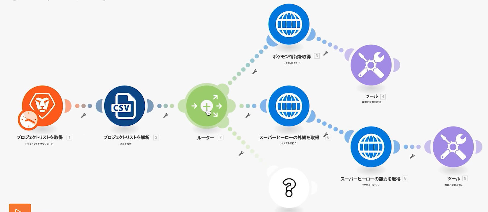

# ルーター

ルータの重要性と、異なるモジュールを条件付きで処理するためにルータを使用する方法を理解します。

## 演習の概要

ルータを使用して、正しいパスに Pokemon vs. superheroes バンドルを渡し、各キャラクタのタスクを作成します。

## 従う手順

1. 前の練習のユニバーサルコネクタの使用シナリオのクローンを作成します。 「Creating different paths using routers」という名前を付けます。

   **モジュールを複製し、ルータを追加して、スーパーヒーローの新しいパスを作成します。**

   

1. 「Get Pokemon info」モジュールを右クリックし、「Clone」を選択します。 複製したら、新しい HTTP モジュールと Parse CSV モジュールの間の行にドラッグ&amp;接続します。

   >[!NOTE]
   >
   > 2 つのパスを持つルータを自動的に追加する方法に注目してください。

1. このモジュールに「Get superhero appearance」という名前を付けます。
1. このモジュールを複製し、複製を右に移動し、「スーパーヒーローアビリティを取得する」という名前を付けます。
1. ツールモジュールのクローンを作成し、2 番目のパスの最後に移動します。
1. ツールバーの自動整列ボタン ( ) をクリックします。

   **シナリオは次のようになります。**

   

   **次に、新しいクローンモジュールのマッピングされた値を変更します。**

1. に移動します。 <https://www.superheroapi.com/> facebookアカウントを使用してアクセストークンを取得します。

   >[!NOTE]
   >
   >独自のスーパーヒーロートークンへのアクセスで問題が発生した場合は、次の共有トークンを使用できます。10110256647253588. スーパーヒーロー API の呼び出し回数に気を配って、この共有トークンが引き続き全員に対して機能するようにしてください。

1. スーパーヒーローの外観を取得する設定を開き、URL をに変更します。 `https://www.superheroapi.com/api/[access- token]/332/appearance`. 必ず URL にアクセストークンを含めてください。 「OK」をクリックします。
1. スーパーヒーローアビリティーの設定を開き、URL をに変更します。 `https://www.superheroapi.com/api/[access- token]/332/powerstats`. 必ず URL にアクセストークンを含めてください。 「OK」をクリックします。
1. 各スーパーヒーローモジュールを右クリックし、「このモジュールのみ実行」を選択します。 これにより、マッピングに必要なデータ構造が生成されます。
1. 両方を実行した後、各 URL フィールドの数値「332」を、「 CSV を解析」モジュールからマッピングされた列 4 に変更します。

   

   **これで、スーパーヒーローパスの「複数の変数を設定」モジュールをクリックして、名前、高さ、重み付け、機能を更新できます。**

1. 「スーパーヒーローアビリティーの取得」モジュールの「名前」フィールドと「アビリティー」フィールドを更新します。モジュール 8.

   

1. Get superhero appearance モジュールの Height フィールドと Weight フィールドを更新します。Module 6.

   

   **完了したら、変数は次のようになります。 モジュール番号は、フィールド値に表示されます。**

   

1. 「 OK 」をクリックして、シナリオを保存します。

   **文字ごとにタスクを作成する別のパスを作成します。**

1. Workfrontで、空のプロジェクトを作成します。 「Shipping Manifest Project」という名前を付け、URL からプロジェクト ID をコピーします。
1. Workfront Fusion に戻り、ルータの中央をクリックして別のパスを作成します。

   

1. 表示される空のモジュールの中央をクリックし、Workfrontアプリからレコードを作成モジュールを追加します。
1. 「レコードの種類」を「タスク」に設定し、「マップするフィールド」セクションで「プロジェクト ID」を選択します。
1. Workfrontからコピーしたプロジェクト ID を「プロジェクト ID 」フィールドに貼り付けます。
1. 次に、「マッピングするフィールド」セクションで「名前」フィールドを選択します。
1. タスクに「[文字] から [フランチャイズ]」と入力します。 列 3 は文字名、列 2 はフランチャイズ名です。

   

1. [OK] をクリックし、このモジュールの名前を [ 各文字のタスクを作成する ] に変更します。

   **エラーなくシナリオを実行できるようにフィルターを追加します。 ポケモン文字だけが上のパスを下に移動し、スーパーヒーロー文字だけが中央のパスを下に移動し、すべての文字が下のパスを下に移動したい。**

1. 「ポケモン情報を取得」モジュールの左側の点線をクリックして、最初のフィルターを作成します。 「ポケモン文字」という名前を付けます。
1. 条件の場合、フランチャイズ（列 2）が「ポケモン」に等しいレコードのみを許可します。 「次と等しい」演算子を選択します。
1. 「スーパーヒーロー外観を取得」モジュールの左側の点線をクリックして、次のフィルターを作成します。 名前に「Superhero character」と入力します。
1. スーパーヒーローは様々なフランチャイズから来ることができるので、「スーパーヒーロー ID 」フィールド（列 4）を使用して、キャラクターがスーパーヒーローかどうかを判断します。

   **フィルターは次のようになります。**

   

   

1. シナリオを保存し、「1 回実行」をクリックします。 実行インスペクターを使用して、すべての操作が成功したことを確認し、Workfrontプロジェクトで作成されたタスクを確認します。

   
