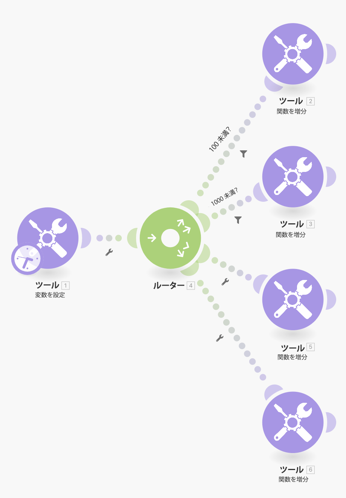
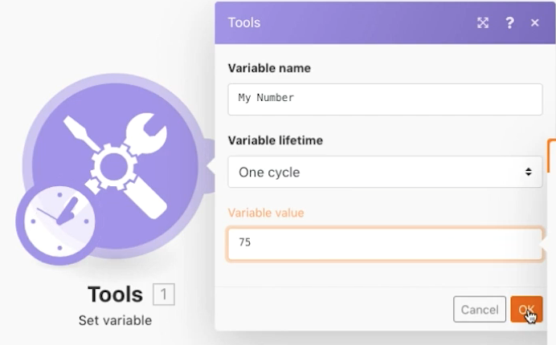

# ルーティングパターンの演習

他の API を実際に使用せずに、ルーティングとフォールバックルートの概念を強化します。

## 演習の概要

変数設定モジュールを使用して、複数のパスを介して数値を送信し、ルーティング時にフィルターとフォールバックがどのように動作するかを確認します。

## 手順

1. 新しいシナリオを作成し、「ルーティングパターンとフォールバック」と名付けます。
1. トリガーの場合、変数設定ツールモジュールを追加します。 変数名に「My Number」を入力し、変数の有効期間を 1 サイクルのままにして、変数フィールドを「75」に設定します。

   

1. 別のモジュールを追加し、ルーターモジュールを選択します。 両方のパスに対して、Increment 機能ツールを選択し、それぞれに変更を加えることなく「OK」をクリックします。

   + 最初のパスに対して、フィルターを作成し、これに「100 未満」という名前を付け、[My Number] の条件を100 未満に設定します。

   + 2 番目のパスに対して、フィルターを作成し、これに「1000 未満」という名前を付け、[My Number] の条件を 1000 未満に設定します。必ず、両方に数値演算子を使用します。

   

   

1. 「1 回実行」をクリックし、バンドルが「100 未満」のパスを渡すことを監視します。
1. 次に、変数モジュール設定フィールドを 950 に変更し、もう一度実行します。 2 つ目のパスの流れを監視します。
1. ルーターをクリックし、パスをもう 1 つ追加します。 Increment 関数ツールモジュールを追加します。 フィルターの場合は、「フォールバックルート」チェックボックスをクリックします。 そのパスを指す矢印が、フォールバック ルートを示すキャレットに変わることを確認します。

   

1. 変数設定の数値を 9500 に変更し、1 回実行します。 この数値が 100 以上または 1000 未満であるため、バンドルはフォールバックルートをたどります。

Increment 関数ツールモジュールでもう 1 つのパスを追加しても、フィルターを設定しない場合に、もう一度「実行」をクリックすると何が起こるでしょうか。バンドルは、4 番目のルートが追加された状態で、フォールバック ルートをたどるでしょうか。

+ いいえ。フィルターが設定されていないので、すべてのバンドルは常にフォールバックルートではなくこのパスをたどります。
