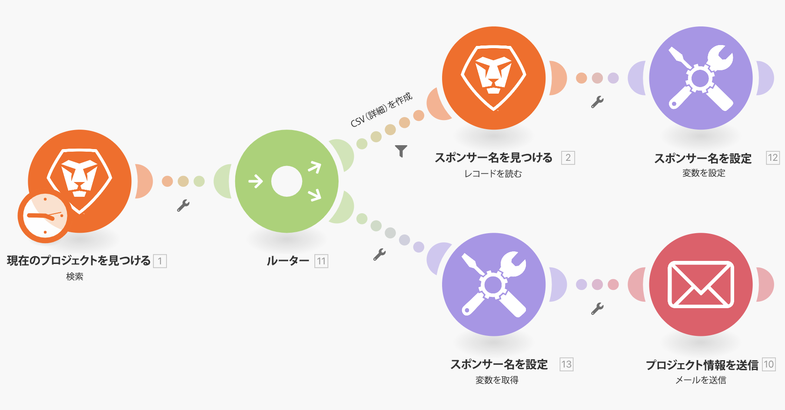
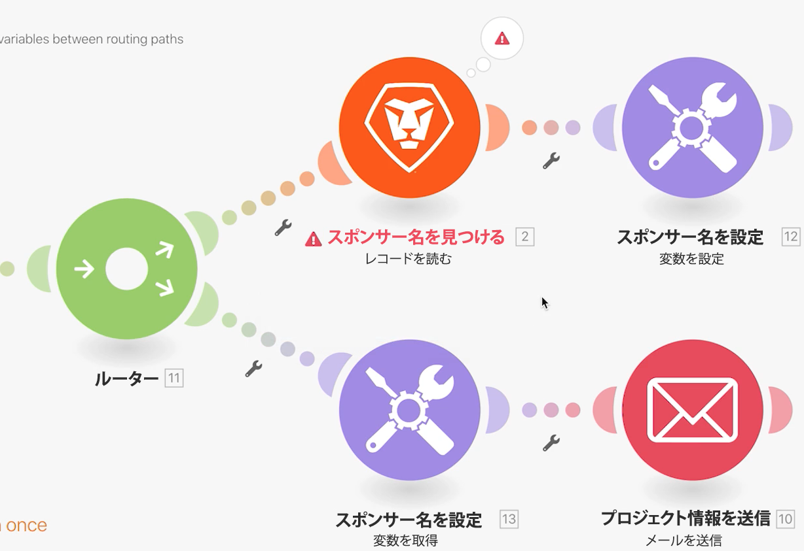

# 変数の設定／取得

「set 変数と get 変数」モジュールを使用して、あるパスで使用できるフィールドを別のパスで使用する方法を説明します。

## 演習の概要

Workfront のプロジェクトに関する情報を検索し、関連情報を記載したメールを送信します。

## 手順

1. 新しいシナリオを作成し、「ルーティングパス間での変数の共有」という名前を付けます。
1. トリガーとして、Workfront アプリの「検索」モジュールを選択します。

   + レコードタイプをプロジェクトに設定します。
   + 結果セットとして、「一致するすべてのレコード」を選択します。
   + 検索条件として、「ステータスが CUR に等しい」を設定します。
   + 出力として、「ID」、「名前」、「説明」、「スポンサー ID」を選択します。

   

   

1. 「OK」をクリックし、このモジュールの名前を「現在のプロジェクトを検索」に変更します。
1. 別のモジュールを追加し、Workfront の「レコードの読み取り」モジュールを選択します。

   + レコードの種類として、「ユーザー」を選択します。
   + 出力として、「名前」を選択します。
   + スポンサー ID を「検索」モジュールから「ID」フィールドにマッピングします。

1. 「OK」をクリックします。
1. モジュール名を「スポンサー名を検索」に変更します。

   

1. シナリオを保存し、「1 回実行」をクリックします。

   「レコードの読み取り」モジュールでエラーが発生した場合は、スポンサーがリストに載っていないプロジェクトを検索モジュールが見つけたことが原因である可能性があります。

   **このエラーを回避するには、次の 2 つのパスを作成します。1 つはスポンサー ID を持つプロジェクト用で、もう 1 つはスポンサー ID を持たないプロジェクト用です。**

1. ルーターと「レコードの読み取り」モジュールの間にあるレンチアイコンをクリックして、2 つのモジュール間にルーターを追加します。「スポンサーが存在する」という名前のフィルターを設定し、「条件」を「スポンサー ID が存在する」に設定します。

   

1. 別のパスを作成するには、ルーターをクリックします。 メールアプリから「メールを送信」モジュールを追加します。

   + 「宛先」フィールドに自分のメールアドレスを入力します。
   + 「件名」フィールドに、「現在のプロジェクト情報」と入力します。
   + 「コンテンツ」フィールドに、プロジェクト名、説明、スポンサーを入力します。
   + 「レコードの読み取り」モジュールからスポンサー名の出力を取り出すことはできません。スポンサー ID には、ルーターより前の検索モジュールからのみアクセスできます。他のルーターパスからスポンサー名にアクセスする方法を見つける必要があります。

   

1. ここでは「OK」をクリックし、このモジュールの名前を「プロジェクト情報を送信」に変更します。

   **set 変数と get 変数を使用して、異なるパス間でデータを共有します。**

1. 「スポンサー名を検索」モジュールの後に、「変数を設定」ツールモジュールを追加します。

   + 変数名に「スポンサー名」と入力します。
   + 変数の有効期間は 1 サイクルのままにします。
   + 「スポンサー名を検索」モジュールから出力された名前にフィールドをマッピングします。

1. 「OK」をクリックし、モジュール名を「スポンサー名を設定」に変更します。

   

1. 次に、ルーターと「メールを送信」モジュールの間を右クリックし、get 変数ツールモジュールを追加します。「変数名」フィールドに「スポンサー名」と入力します。
1. 「OK」をクリックします。 モジュール名を「スポンサー名を取得」に変更します。

   

1. メールを送信モジュールに戻り、スポンサー名を取得モジュールの値を「コンテンツ」フィールドにマッピングします。「OK」をクリックします。

   

   >[!IMPORTANT]
   >
   >シナリオをテストする前に、処理するプロジェクトの数を制限して、大量のメールを受信しないようにすることをお勧めします。

1. Workfront の体験版に移動し、Northstar Fashion Exhibitors Boot プロジェクトを検索します。これは、スポンサーがいる現在のプロジェクトです。URL からプロジェクト ID をコピーします。

   

1. シナリオでは、現在のプロジェクトを検索モジュールをクリックします。緑の「AND ルールを追加」ボタンをクリックして、別の条件を検索条件に追加します。ID がコピーしたプロジェクト ID と同じである必要があるとを指定します。 「OK」をクリックします。
1. シナリオを保存し、「1 回実行」をクリックします。
1. 実行インスペクターと受信するメールをレビューします。

   
