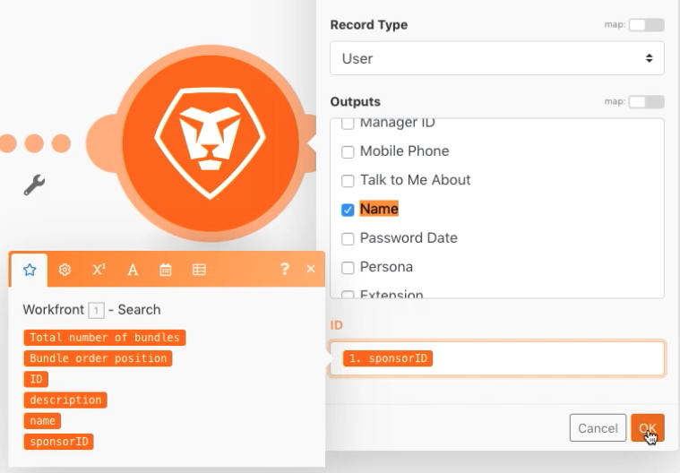

# 変数の設定/取得

変数設定モジュールと変数の取得モジュールを使用して、1 つのパスで使用できるフィールドを別のパスで使用する方法を説明します。

## 演習の概要

Workfrontのプロジェクトに関する情報を検索し、関連情報を記載した電子メールを送信します。

## 従う手順

1. 新しいシナリオを作成し、「ルーティングパス間での変数の共有」という名前を付けます。
1. トリガーの場合、Workfrontアプリで検索モジュールを選択します。

   + [ レコードの種類 ] を [ プロジェクト ] に設定します。
   + 結果セットの場合は、「一致するすべてのレコード」を選択します。
   + 検索条件では、[Status Equal to CUR] に設定します。
   + 「出力」で、「ID」、「名前」、「説明」および「スポンサー ID」を選択します。

   

   

1. 「OK」をクリックし、このモジュールの名前を「現在のプロジェクトを検索」に変更します。
1. 別のモジュールを追加し、「 Workfrontレコードの読み取り」モジュールを選択します。

   + 「レコードの種類」で「ユーザー」を選択します。
   + [ 出力 ] で [ 名前 ] を選択します。
   + 検索モジュールの Sponsor ID を「 ID 」フィールドにマッピングします。

1. 「OK」をクリックします。
1. モジュール名を「Find sponsor name」に変更します。

   

1. シナリオを保存し、「1 回実行」をクリックします。

   「レコードの読み取り」モジュールでエラーが発生した場合は、スポンサーがリストに載っていないプロジェクトを検索モジュールが見つけたことが原因である可能性が高くなります。

   **このエラーを回避するには、次の 2 つのパスを作成します。1 つはスポンサー ID を持つプロジェクト用で、もう 1 つはスポンサー ID を持たないプロジェクト用です。**

1. ルータとレコードの読み取りモジュールの間のレンチアイコンをクリックして、2 つのモジュール間にルータを追加します。 「Sponsor exists」という名前のフィルターを設定し、「Condition」を「Sponsor ID Exists」に設定します。

   

1. 別のパスを作成するには、ルータをクリックします。 電子メールアプリから電子メールを送信モジュールを追加します。

   + 「宛先」フィールドに自分のメールアドレスを入力します。
   + 件名フィールドに、「現在のプロジェクト情報」と入力します。
   + 「コンテンツ」フィールドに、プロジェクト名、説明、スポンサーを入力します。
   + 「レコードの読み取り」モジュールからスポンサー名の出力を取り出すことはできません。 スポンサー ID には、ルーターより前の検索モジュールからのみアクセスできます。 他のルータパスからスポンサー名にアクセスする方法を見つける必要があります。

   

1. ここでは [OK] をクリックし、このモジュールの名前を「プロジェクト情報を送信」に変更します。

   **Set/Get 変数を使用して、異なるパス間でデータを共有します。**

1. 「スポンサー名を検索」モジュールの後に、「変数を設定」ツールモジュールを追加します。

   + 変数名に「Sponsor name」と入力します。
   + 変数の有効期間は 1 サイクルのままにします。
   + 「スポンサー名を検索」モジュールから出力された名前にフィールドをマッピングします。

1. 「OK」をクリックし、モジュール名を「Set Sponsor name」に変更します。

   

1. 次に、ルータと Send an email モジュールの間を右クリックし、Get variable ツールモジュールを追加します。 「変数名」フィールドに「スポンサー名」と入力します。
1. 「OK」をクリックします。 モジュール名を「Get Sponsor name」に変更します。

   

1. 「 E メールを送信」モジュールに戻り、「スポンサー名を取得」モジュールの値を「コンテンツ」フィールドにマッピングします。 「OK」をクリックします。

   

   >[!IMPORTANT]
   >
   >このシナリオをテストする前に、大量の E メールが送信されるのを避けるために、処理するプロジェクトの数を制限することをお勧めします。

1. Workfrontのテストドライブに移動し、Northstar Fashion Extoriors Booth プロジェクトを探します。 これはスポンサーを持つ現在のプロジェクトです URL からプロジェクト ID をコピーします。

   

1. シナリオで、「現在のプロジェクトを検索」モジュールをクリックします。 緑色の「AND ルールを追加」ボタンをクリックして、別の条件を検索条件に追加します。 ID がコピーしたプロジェクト ID と同じである必要があることを指定します。 「OK」をクリックします。
1. シナリオを保存し、「1 回実行」をクリックします。
1. 実行インスペクターと受信する E メールを確認します。

   
