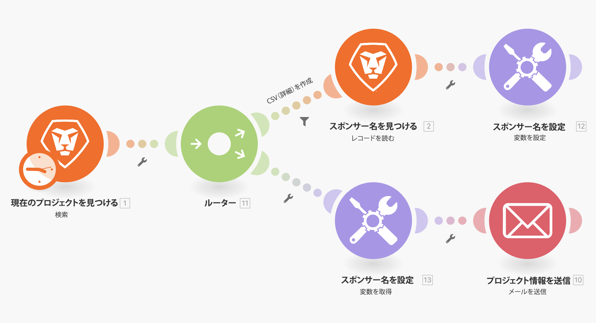
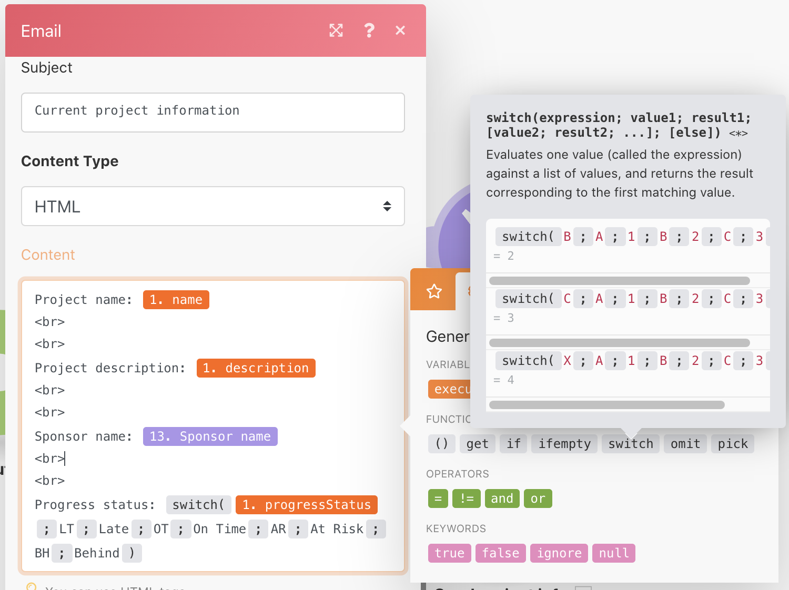

# スイッチ機能の演習

スイッチ関数を使用した切り替え機能の使用方法を説明します。

## 演習の概要

単純なデータ変更の場合は、スイッチ関数を使用して、モジュールフィールド内の値を別の値に変換します。この演習では、2 文字のキーをプロジェクトの進捗ステータスの実際の名前に変更し、メールで送信します。

## 手順

1. 「ルーティングパス間での変数の共有」というシナリオを複製します。
1. 新しいシナリオに「ルーティングパス間での変数の共有（スイッチ）」という名前を付けます。
1. トリガーモジュールをクリックし、「出力」セクションに「進捗ステータス」を追加します。
1. 「メールを送信」モジュールで、「コンテンツ」フィールドに「進捗ステータス」を追加します。

   + 「検索」モジュールから取得した値の上にマッピングするだけの場合、進捗ステータスを示す 2 文字のコードが表示されます。
   + コードを各進捗ステータスのフルネームに「切り替える」には、「一般関数」タブの「スイッチ」関数を使用します。

1. スイッチ関数は、進捗ステータスの値または式をキーとして使用し、そのキーに基づいて出力値を返します。

   + キー値は進捗ステータス（LT）の後の最初の位置で定義され、対応する出力（遅延）は 2 番目の位置で定義されます。
   + 次のキー値は 3 番目の位置で定義され、それに対応する出力は 4 番目の位置で定義されます。このようにして、必要な数のキーに対して定義されます。

     
