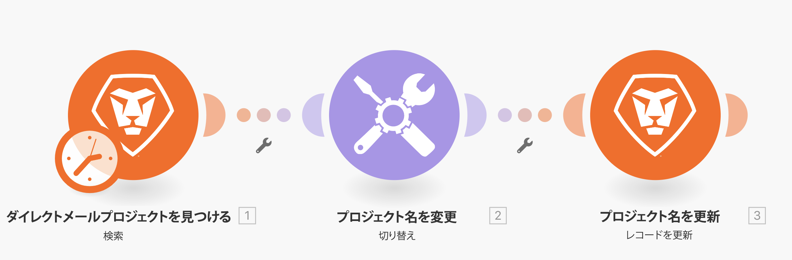

# スイッチモジュールの演習

より複雑なデータ変換や動的なデータ変換を実行する必要がある場合にスイッチモジュールを使用する方法について説明します。

## 演習の概要

体験版でダイレクトメールプロジェクトを検索し、プロジェクトに添付されたカスタムフィールドで選択した値に基づいて各プロジェクトの名前を変更します。

## 手順

1. 新しいシナリオを作成し、「スイッチモジュールの使用」という名前を付けます。
1. トリガーモジュールには、Workfront 検索モジュールを使用します。
1. Workfront 接続を設定し、レコードタイプをプロジェクトに設定します。
1. 検索条件で、「チャネル」カスタムフィールドに値を持つプロジェクトのみを表示するように指定します。
1. 出力には、ID、名前、参照番号、「チャネル」カスタムフィールドを選択します。

   

1. ツールからスイッチモジュールを追加します。
1. 「入力」フィールドには、検索モジュールから「チャネル」カスタムフィールドをマッピングします。

   

1. 次に、「チャネル」カスタムフィールドから取得される可能性のある値ごとにケースを追加します。可能性のある値は、「パターン」フィールドに取得されます。出力フィールドに、特定の 3 文字コード、プロジェクト参照番号、プロジェクト名を含める必要があります。

   **マッピングパネルは次のようになります。**

   

1. 追加のケースは、必要な数だけ追加できます。下部には、「その他」フィールドがあります。これは、入力値がどのケースにも一致しない場合に使用します。

   **Workfront でプロジェクト名を更新します。**

   

1. Workfront のレコードを更新モジュールを追加します。
1. 「ID」フィールドで、トリガーモジュールから ID にマッピングします。
1. レコードタイプをプロジェクトに設定します。
1. 「マッピングするフィールドを選択」セクションから「名前」フィールドを選択し、スイッチモジュールからの出力にマッピングします。
1. シナリオを保存し、1 回実行します。 体験版で、更新したプロジェクト名を表示します。
