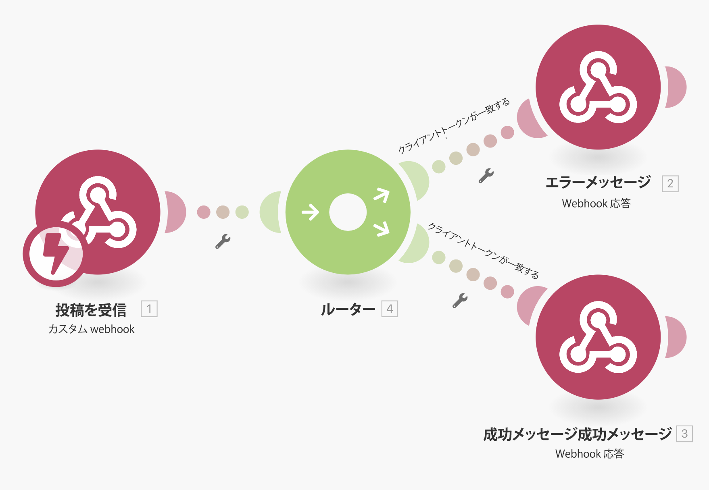
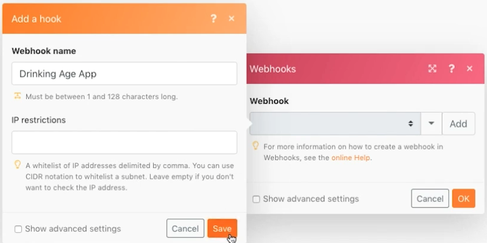

# ウェブフック

Webhook で開始されるシナリオを作成、トリガー、管理する方法について説明します。

## 演習の概要

このシナリオの目的は、コンビニに販売するアプリを作成し、顧客がお酒を買う年齢に達しているかどうかを簡単に判断できるようにすることです。 会社は、顧客の名前と誕生日を、提供された URL に投稿するだけで済みます。 この投稿は、トリガーに応答を計算し、要求者に返すシナリオを計算します。

1. このシナリオは、3 つの Web フックで構成されます。
1. トリガーモジュールは、投稿をリッスンするカスタム Webhook です。
1. 投稿を受け取ると、次のモジュールの 1 つに出力されます。
1. 次のモジュールは、リクエスト元への応答を返します。

   

## 従う手順

**トリガーWebhook を設定します。**

1. 新しいシナリオを作成し、「Webhook を使用」という名前を付けます。
1. トリガーの場合、Webhook アプリからカスタム Webhook モジュールを追加します。
1. 「追加」をクリックして、新しい Webhook を作成します。
1. 「飲用年齢アプリ」の Webhook 名を入力します。
1. IP 制限は空白のままにします。つまり、誰でもデータを送信できます。
1. 「保存」をクリックします。

   

1. Webhook マッピングパネルに戻ると、この特定の Webhook 用の URL が作成されます。 「アドレスをクリップボードにコピー」をクリックして、その URL をコピーします。
1. 「OK」をクリックします。
1. 「実行」を 1 回クリックします。
1. この URL をPostmanで使用して、名前と誕生日をカスタム Webhook に送信します。 Postmanの設定手順については、 [Webhooks のチュートリアル](https://experienceleague.adobe.com/docs/workfront-learn/tutorials-workfront/fusion/beyond-basic-modules/webhooks-walkthrough.html?lang=en) チュートリアル

   **Webhooks モジュールパネルは次のようになります。**

   

   **Webhook は、データ構造を判断するためにデータをリッスンしている状態になりました。**

1. 取得するペイロードのデータ構造を定義できます（データ構造については後で説明します）。 データ構造を定義していない場合、Fusion は、投稿の送信時にデータ構造を自動的に決定します。
1. Postman側で、コピーした URL にを送信します。 投稿には、基本的なフォームデータが含まれている必要があります。 この例では、次の 3 つのフィールドが必要です。名前、生年月日、clientToken。

   

1. 「Postmanから送信」をクリックした後、投稿が許可されたことを示すメッセージが表示されます。
1. これは、シナリオで、データ構造が正常に決定されたことを示すポイントです。
1. 実行インスペクターを開くと、データが受信されたことを確認できます。

   

   **クライアントトークンのルーティングを設定します。**

1. ルータをトリガーモジュールに追加します。
1. 上部のパスに、Webhook 応答モジュールを追加します。 クライアントトークンが一致しない場合、これがのパスになります。
1. ステータスを 401 に設定します。
1. 本文を {&quot;error&quot;に設定します。「要求を認証できませんでした。 clientToken&quot;} を確認してください。

   

1. ルータと Webhook 応答モジュールの間にフィルタを作成します。 「クライアントトークンが一致しません」という名前を付けます。
1. 条件の場合は、トリガーモジュールの clientToken フィールドを使用し、数値5121933との比較を「等しくない」という数値で行います。

   

1. 下のパスに、別の Webhook 応答モジュールを追加します。 クライアントトークンが一致する場合、これがのパスになります。
1. ステータスを 200 に設定します。
1. 本文の設定では、マッピングパネルの関数を使用して、人物が 21 歳以上かどうかをテストします。 もし彼らがあるなら、「あなたは十分に飲む年齢だ！」を返し、それ以外の場合は、「あなたは不運です…」を返します。

   

1. ルータと Webhook 応答モジュールの間に、下のパスにフィルタを作成します。 「クライアントトークンが一致します」という名前を付けます。
1. 条件の場合は、トリガーモジュールの clientToken フィールドを使用し、数値5121933との「等しい」比較を行います。

   

1. 「 1 回実行」の下の「スケジュール設定」ボタンをクリックして、新しい投稿があったときにその投稿を受け取るようにシナリオをアクティブ化し、いずれかのパスを下に移動して、応答を生成します。
