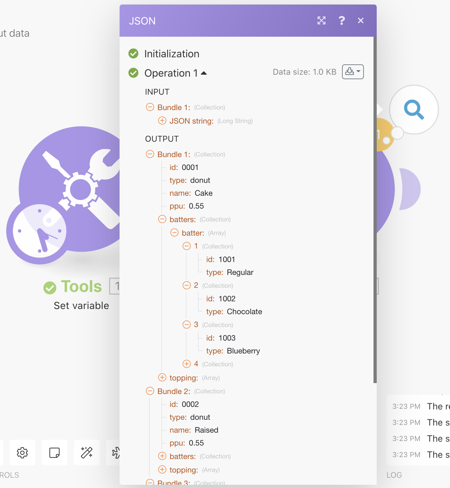
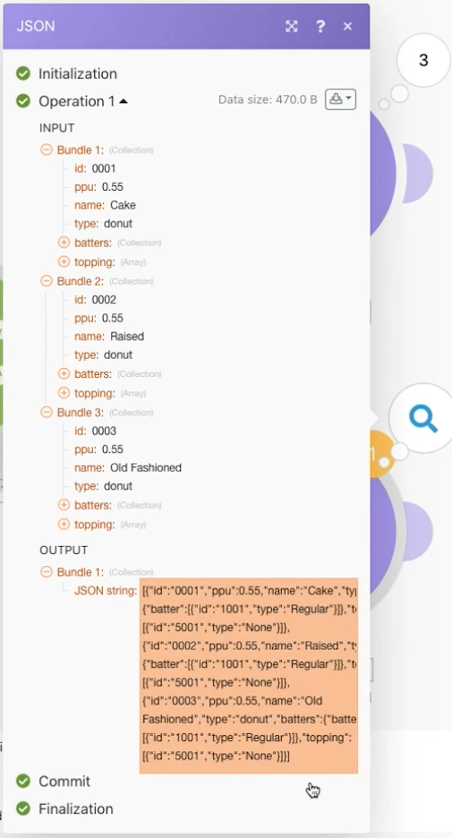

# JSON の操作の演習

シナリオ内で JSON を作成および解析して、デザインのニーズに対応する方法を説明します。

## 演習の概要

この演習の目的は、シナリオに送信された情報を JSON 形式で利用し、シナリオ全体でマッピングできるフィールドとアイテムに解析する方法を概念的に示すことです。その後、マッピングされた配列から情報を取得するか、情報を JSON に集計して、JSON を受信入力として期待する別のシステムに送信できます。

## 手順

**データ構造を作成し、JSON を解析します。**

1. 新しいシナリオを作成し、「JSON ドーナツデータの操作」という名前を付けます。
1. トリガーモジュールには、「変数を設定」モジュールを使用します。
1. 変数名に「ドーナツデータ」と入力します。
1. 変数値には、テストドライブの Fusion Exercise Files フォルダーにある「_Donut Data - Sample JSON.rtf」ドキュメントの内容をコピーして貼り付けます。

   

1. このモジュールの名前を「別のコネクタからの JSON」に変更します。
1. 「JSON を解析」モジュールを追加します。
1. 「データ構造」フィールドの「追加」をクリックします。
1. 「ジェネレーター」を選択し、「サンプルデータ」フィールドにコピーした「ドーナツデータ — サンプル JSON データ」を貼り付けます。

   

1. 「保存」をクリックし、データ構造に「ドーナツデータ」という名前を付けます。次に「保存」をクリックします。
1. 「変数を設定」モジュールのドーナツデータを「JSON 文字列」フィールドにマッピングします。

   

1. シナリオを保存し、「1 回実行」をクリックして出力を表示します。

   **「JSON を解析」モジュールの出力は次のようになります。**

   

   **特定の配列変数にマッピングします。**

1. 「JSON を解析」モジュールの後にルーターを追加します。
1. 上部のパスに「変数を設定」モジュールを追加します。
1. 「変数名」に「ドーナツ別の生地の種類」と入力します。
1. 変数値には、map 関数を使用して、生地の配列から記事の種類を取得します。

   

1. 「OK」をクリックし、「1 回実行」をクリックします。
1. 実行インスペクターを開き、3 つの各操作の出力バンドルを確認し、それぞれの生地のタイプを表示します。

   

   **シナリオデータを JSON に集計します。**

1. 下のルーティングパスに「JSON に集計」モジュールを追加します。
1. ソースモジュールには、イテレータ（「JSON 解析」モジュール）を選択します。
1. データ構造には、任意のデータ構造を作成するか選択します。この例では、ドーナツデータを使用します。
1. 次に示すように、この例のフィールドを直接マッピングします。
1. 生地とトッピングを取得すると、これらは配列であることがわかります。そのため、「アイテムを追加」をクリックして、マッピングする必要があります。

   

1. シナリオを保存し、「1 回実行」をクリックします。

「JSON に集計」モジュールの実行インスペクターを確認すると、3 つのバンドルが 1 つの JSON 文字列に集計できたことがわかります。その後、この文字列を JSON を待ち受ける他のシステムに送信できます。

