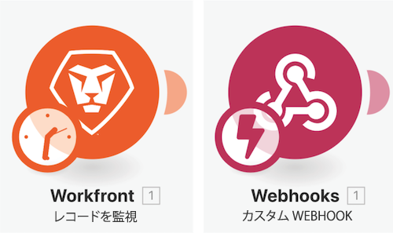
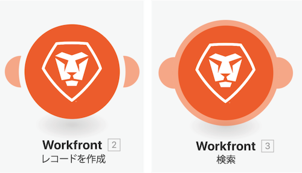

# 以前のバージョンへのアクセスのチュートリアル

このビデオでは、次の操作を実行します。

* シナリオに変更を加えて複数回保存した後、以前のバージョンを復元する方法を説明します。

## 以前のバージョンへのアクセスの手順

Workfront では、独自の環境で演習を再現する前に、演習のチュートリアルのビデオを見ることをお勧めします。

>[!VIDEO](https://video.tv.adobe.com/v/3416537/?quality=12&learn=on&enablevpops=1&captions=jpn)

>[!NOTE]
>
>シナリオを保存した後、将来アクセスする必要がある場合、「...」メニューから新しいバージョンを使用できます。以前に保存したシナリオのバージョンは 60 日間のみ使用できます。監査目的で 60 日を超える以前のバージョンにアクセスする必要がある場合、Workfront では、シナリオのブループリントを保存し、同意された場所にアーカイブすることをお勧めします。

## 用語の追加

### トリガーモジュール

トリガーモジュールは、最初のモジュールとしてのみ使用でき、0 個、1 個または複数のバンドルを返すことができます。これらは、集約されない限り、後続のモジュールで個別に処理されます。

**ポーリングトリガー（トリガー時に時計）** - 最後に処理されたレコードを追跡するための特別な機能。

**インスタントトリガー（トリガー時に稲妻）** - Webhook に基づいて、直ちにトリガーされます。

### アクションと検索モジュール

**アクション** - CRUD（作成、読み取り、更新、削除）操作の実行に使用

**検索** - 0 個、1 個または複数のレコードを検索し、それらをバンドルとして返します。これは、集約しない限り、後続のモジュールで個別に処理されます。

## 詳細情報 以下をお勧めします。

[Workfront Fusion ドキュメント](https://experienceleague.adobe.com/ja/docs/workfront-fusion/using/get-started-with-fusion/understand-workfront-fusion/workfront-fusion-overview)
