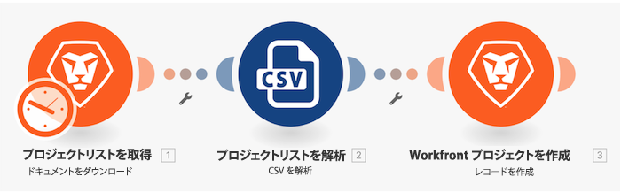

# 基本マッピングを超えるチュートリアル

マッピングパネル式を使用して、最初のチュートリアルで作成した「最初のシナリオデザイン」から、プロジェクト名、開始予定日、優先度を変更します。

## 基本マッピングを超えるチュートリアル

Workfront では、独自の環境で演習を再現する前に、演習のチュートリアルのビデオを見ることをお勧めします。

>[!VIDEO](https://video.tv.adobe.com/v/335264/?quality=12&learn=on&enablevpops=1)

## やってみよう

>[!NOTE]
>
>練習の演習や課題は任意で、Fusion トレーニングを完了するのに必須ではありません。

この練習は、チュートリアルで学習した内容に基づいて構築されますが、ソリューションは提供されていません。

完了した「基本マッピングを超える」チュートリアルのクローンを作成します。 このシナリオは次のチュートリアルでも引き続き使用するので、この演習では変更しないでください。

前のチュートリアルの一部として作成した各プロジェクトにタスクを作成します。

* タスク名として「Initial Planning for a (Project Color) Project」を使用します。
* 開始予定日をプロジェクトの開始予定日と同じ設定にします。
* 期間を 3 日に、期間タイプを「予定割り当て時間」に設定します。
* 予定時間数を時間単位で信頼性評価の 10% に設定します。
* タスクの制約を「できるだけ早く」に設定します。

**課題：** プロジェクトカラーが赤の場合は、タスクを Rick Kuvec さんに割り当てます。 プロジェクトカラーが黄色の場合は、タスクを Mary Smith さんに割り当てます。 プロジェクトカラーが緑の場合は、タスクを Ida Blankenship さんに割り当てます。

## 詳細情報 以下をお勧めします。

[Workfront Fusion のドキュメント](https://experienceleague.adobe.com/ja/docs/workfront-fusion/using/get-started-with-fusion/understand-workfront-fusion/workfront-fusion-overview)
