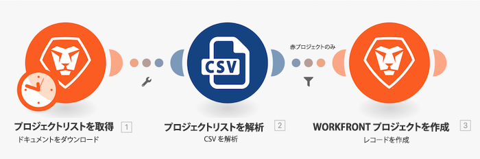

# フィルターのチュートリアル

前に作成した「基本マッピングを超える」チュートリアルの演習を使用して、モジュール内の 2 つのモジュール間にフィルターを追加し、プロジェクトリストでプロジェクト色が「赤」であるプロジェクトのみを作成します。

## フィルターのチュートリアル

Workfront では、独自の環境で演習を再現する前に、演習のチュートリアルのビデオを見ることをお勧めします。

このビデオでは、次の方法を学習します：

* モジュール内の 2 つのモジュール間にフィルターを追加する

>[!VIDEO](https://video.tv.adobe.com/v/335266/?quality=12&learn=on&enablevpops)

## やってみよう

>[!NOTE]
>
>練習の演習や課題は任意で、Fusion トレーニングを完了するのに必須ではありません。

この練習は、チュートリアルで学習した内容に基づいて構築されますが、ソリューションは提供されていません。

フィルターのチュートリアルで作成したフィルターを変更して、「黄」で信頼性評価が 100 未満のプロジェクト、またはプロジェクト名に「phase」という語が含まれる 2021 年に開始予定のプロジェクトのみを許可するようにします。変更したフィルターに「Practice Exercise Filter」という名前を付けます。

**課題**：信頼性評価が均等なプロジェクトのみを通過できるフィルターを作成してみてください。 ヒントが必要な場合 数式を見てみましょう。

## 詳細情報 以下をお勧めします。

[Workfront Fusion ドキュメント](https://experienceleague.adobe.com/en/docs/workfront-fusion/using/get-started-with-fusion/understand-workfront-fusion/workfront-fusion-overview)
