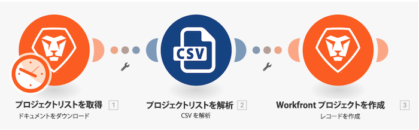

# 初期シナリオデザインのチュートリアル

Workfront で、プロジェクトリストの CSV ファイルの各レコードに対して新しいプロジェクトを作成します。



Workfront では、独自の環境で演習を再現する前に、演習のチュートリアルのビデオを見ることをお勧めします。

このビデオでは、次の方法を学習します：

* フォルダーの作成と新しいシナリオ
* シナリオ designer の使用
* 基本的なシナリオの作成

>[!VIDEO](https://video.tv.adobe.com/v/335261/?quality=12&learn=on&enablevpops=1)

## 以下は、テストドライブインスタンスで OAuth アプリ統合を作成する際に「**リダイレクト URL**」フィールドに貼り付ける URL です

```
https://app.workfrontfusion.com/oauth/cb/workfront-workfront
```

## 詳細情報 以下をお勧めします。

[Workfront Fusion ドキュメント](https://experienceleague.adobe.com/ja/docs/workfront-fusion/using/get-started-with-fusion/understand-workfront-fusion/workfront-fusion-overview)
