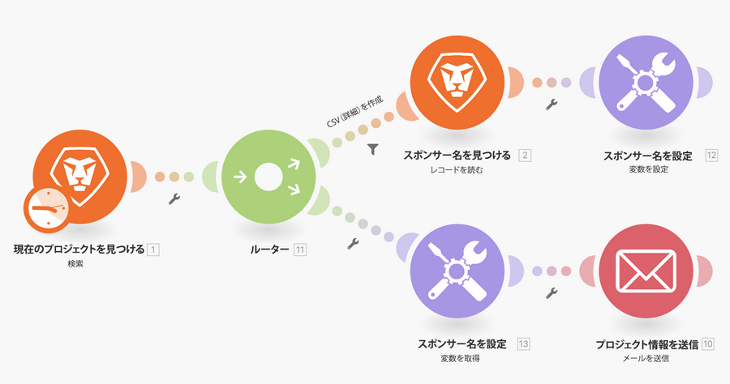

# 変数の設定／取得のチュートリアル

Workfront のプロジェクトに関する情報を検索し、関連情報を記載したメールを送信します。

## get／set 変数のチュートリアル

Workfront では、独自の環境で演習を再現する前に、演習のチュートリアルのビデオを見ることをお勧めします。

>[!VIDEO](https://video.tv.adobe.com/v/335276/?quality=12&learn=on&enablevpops)

## やってみよう

>[!NOTE]
>
>練習の演習や課題は任意で、Fusion トレーニングを完了するのに必須ではありません。

この練習は、チュートリアルで学習した内容に基づいて構築されますが、ソリューションは提供されていません。

このチュートリアルで作成した「ルーティングパス間での変数の共有」シナリオのクローンを作成します。作成したメッセージを、プロジェクト所有者およびプロジェクトスポンサーにメールで送信します。 また、メッセージにプロジェクト条件を含めることもできます。 （現時点では、条件が 2 文字のキーとして表示されても問題ありません。）

**課題：**&#x200B;この「メール」を毎週月曜日の午前 8 時に送信するようにシナリオをスケジュールします。

## 詳細情報 以下をお勧めします。

[Workfront Fusion ドキュメント](https://experienceleague.adobe.com/en/docs/workfront-fusion/using/get-started-with-fusion/understand-workfront-fusion/workfront-fusion-overview)
