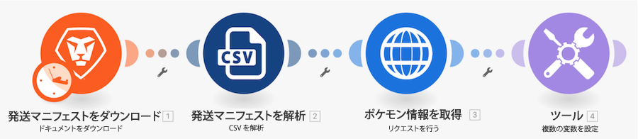

# ユニバーサルコネクタの概要のチュートリアル

## 概要

スプレッドシートでポケモンのキャラクターを使用して、HTTP コネクタを介して Poke API を呼び出し、そのキャラクターに関する詳細を収集して投稿します。

## ユニバーサルコネクタの概要のチュートリアル

Workfront では、独自の環境で演習を再現する前に、演習のチュートリアルのビデオを見ることをお勧めします。

>[!VIDEO](https://video.tv.adobe.com/v/335270/?quality=12&learn=on&enablevpops)

### 演習 URL

Pokemon API web サイト： `https://pokeapi.co/`

演習の URL：`https://pokeapi.co/api/v2/pokemon/{Character}`

## 詳細情報 以下をお勧めします。

[Workfront Fusion ドキュメント](https://experienceleague.adobe.com/docs/workfront/using/adobe-workfront-fusion/workfront-fusion-2.html?lang=ja)
