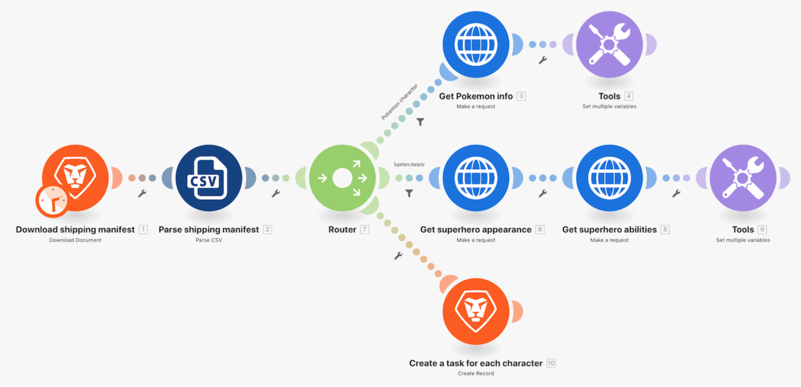

# ルーターのチュートリアル

## 概要

ルータを使用して、正しいパスに Pokemon vs. superheroes バンドルを渡し、各キャラクタのタスクを作成します。

## ルーターのチュートリアル

Workfrontは、独自の環境で演習を再作成する前に、演習のチュートリアルのビデオを見ることをお勧めします。

>[!VIDEO](https://video.tv.adobe.com/v/335272/?quality=12)

## 演習 URL

* Superhero API Web サイト：https://www.superheroapi.com/
* 演習の最初の URL:https://www.superheroapi.com/api/{access-token}/{character-id}/appearance
* 演習の 2 番目の URL:https://www.superheroapi.com/api/{access-token}/{character-id}/powerstats

独自のスーパーヒーロートークンへのアクセスで問題が発生した場合は、次の共有トークンを使用できます。10110256647253588. スーパーヒーロー API の呼び出し回数に気を配って、この共有トークンが引き続き全員に対して機能するようにしてください。

>[!TIP]
>
>チュートリアルの完了手順については、 [ルーターのチュートリアル](https://experienceleague.adobe.com/docs/workfront-learn/tutorials-workfront/fusion/exercises/routers.html?lang=en) 運動。

## マッピングパネルでの項目の検索

マッピングパネルの上部にある「検索項目」フィールドを使用すると、配列内にネストされているフィールドでも、パネル内のフィールドをすばやく見つけることができます。 検索では、大文字と小文字が区別されません。

## API を使用する際のヒントとテクニック

これまで、シナリオで必要な情報を取り込むために追加の認証を必要としない、非常にシンプルな API（アプリケーションプログラミングインターフェイス）を使用して作業しました。 API やユニバーサルコネクタを使用する際に役立つヒントを以下に示します。

## 手順 1:API のタイプの決定

Workfrontや多くのソフトウェアシステムは、現在最も簡単で最も標準的なタイプの API である REST(Representational State Transfer) API を使用して構築されています。 ただし、その他にも、次のような機能があります。

* SOAP(Simple Object Access Protocol)(Workfront Proof API は SOAP ベース )
* FTP（ファイル転送プロトコル）
* SFTP（セキュアファイル転送プロトコル）
* 詳しくは、Web 検索を実行して、API タイプと興味のあるキーワードを確認してください。

>[!NOTE]
>
>Salesforce などの大規模なプラットフォームに接続する場合、プラットフォームの異なる領域で異なる API が提供されます。 接続先のサービスに適したサービスが見つかっていることを確認します。

## 手順 2:API で必要な認証のタイプの決定

API 認証は、Workfront Fusion を通じて接続しようとする場合など、サービスへのアクセスを制御するために使用される識別形式です。 これは、システムへのアクセスが許可されていることを別のシステムに証明するのに役立ちます。 OAuth 2 は、現在使用されている最も一般的な認証タイプです。 API 認証に関するインターネット検索の詳細を説明します。

認証は、API を使用する場合の最も難しい側面になる可能性があります。 Workfront Fusion のユニバーサルコネクタの最も役に立つ機能の 1 つは、Workfront Fusion が、OAuth 2、API キーなどの基本認証などの一般的な認証方法を使用する場合に認証を処理できる点です。 認証方法（OAuth 2 など）に適したWorkfront Fusion モジュールを使用して接続を作成すると、Workfront Fusion は、シナリオを実行するたびに API キーやトークンを継続的に生成します。

Experience Leagueに関する拡張認証の概要記事で、Workfrontが提供する様々な種類の認証について説明します。

## 手順 3:API ドキュメントを読み、必要なエンドポイントを見つけます

API が別のシステムとやり取りする場合、この通信のタッチポイントはエンドポイントと見なされます。 エンドポイントとは、API がリクエストを送信する場所と、リソースが存在する場所です。

ユニバーサルコネクタを使用して API を操作する場合、API がサポートするエンドポイントと、各リクエストに必要なデータを理解する必要があります。 API ドキュメントでは、API のエンドポイントと、作成、読み取り、更新、削除などの一般的な操作の実行方法を説明する必要があります。 これらの呼び出しを実行するには、特に API 呼び出しをおこなうことが初めての場合や、新しい API を使用する場合など、いくつかの手法が必要です。

Workfront Fusion Universal Connectors の詳細と、Experience Leagueで必要な API に接続するための設定方法について説明します。

## 最終メモ

事前に作成されたアプリコネクタのリスト全体をExperience Leagueで確認できます。 新しいアプリコネクタをWorkfront Fusion 製品チームに提案する場合は、アイデアを Innovation Lab に送信します。 まだ提出していない場合は、イノベーションラボの詳細に加えて、アイデアに投票し、年 2 回のリーダーボードの優先順位付けに参加する方法を学びます。 既に Innovation ラボにアクセスできる場合は、ログインしてアイデアを送信します。

## あなたのターン

この練習は、チュートリアルで学習した内容に基づいて構築されますが、ソリューションは提供されていません。

ポケモン文字用の複数の変数を設定モジュールで、「Stat (Level)」と呼ばれる変数を作成します。 この変数にポケモン統計の名前をマッピングします。 配列値機能を使用して、配列の表示方法を変更し、各 Stat が以下のように新しい行になるようにします。

**ヒント：** 対応するレベルのポケモン統計は 6 種類しかありません。

**課題：** 配列の数式を使用して、値の文字列をコンマで区切って表示するのではなく、異なる行と同様に上記と同じように表示できるかどうかを確認します。 下のスクリーンショットにヒントがあります。

## 詳細情報 以下をお勧めします。

[Workfront Fusion ドキュメント](https://experienceleague.adobe.com/docs/workfront/using/adobe-workfront-fusion/workfront-fusion-2.html?lang=en)
