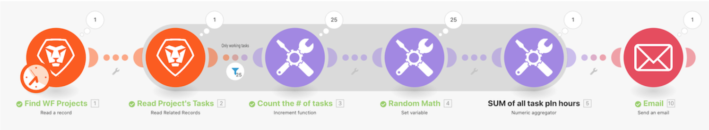

# 集計のチュートリアル

## 概要

前のチュートリアルで作成した「イテレーションの概要」シナリオを使用して、プロジェクト内のすべての作業タスクの予定時間数を集計し、その情報を記載したメールを自分宛てに送信します。

## 集計のチュートリアル

Workfront では、独自の環境で演習を再現する前に、演習のチュートリアルのビデオを見ることをお勧めします。

>[!VIDEO](https://video.tv.adobe.com/v/3417293/?captions=jpn&quality=12&learn=on&enablevpops=1)

## 詳細情報 以下をお勧めします。

[Workfront Fusion のドキュメント](https://experienceleague.adobe.com/ja/docs/workfront-fusion/using/get-started-with-fusion/understand-workfront-fusion/workfront-fusion-overview)
