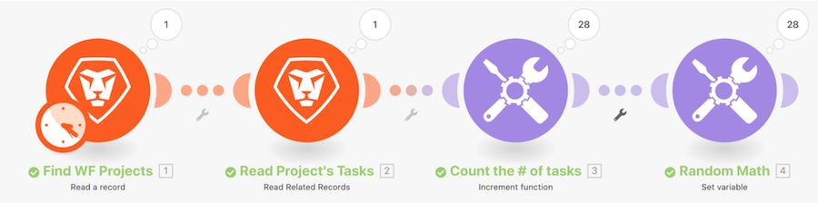

# イテレータの概要のチュートリアル

Workfront で特定のプロジェクトを確認してから、そのプロジェクト内のすべてのタスクを確認します。次に、増分ツールモジュールを使用してプロジェクト内のタスクの数をカウントします。最後に、変数を設定モジュールを使用して、オープンイシューの数から子の数を減算し、各タスクバンドルの数値を生成します。

## イテレータの概要のチュートリアル

Workfront では、独自の環境で演習を再現する前に、演習のチュートリアルのビデオを見ることをお勧めします。

>[!VIDEO](https://video.tv.adobe.com/v/335278/?quality=12&learn=on)

>[!TIP]
>
>チュートリアルを完了するための段階的な手順については、[イテレータの概要チュートリアル](https://experienceleague.adobe.com/docs/workfront-learn/tutorials-workfront/fusion/exercises/introduction-to-iterators-exercise.html?lang=en)の演習にアクセスしてください。

## 詳細情報 以下をお勧めします。

[Workfront Fusion ドキュメント](https://experienceleague.adobe.com/docs/workfront/using/adobe-workfront-fusion/workfront-fusion-2.html?lang=ja)
