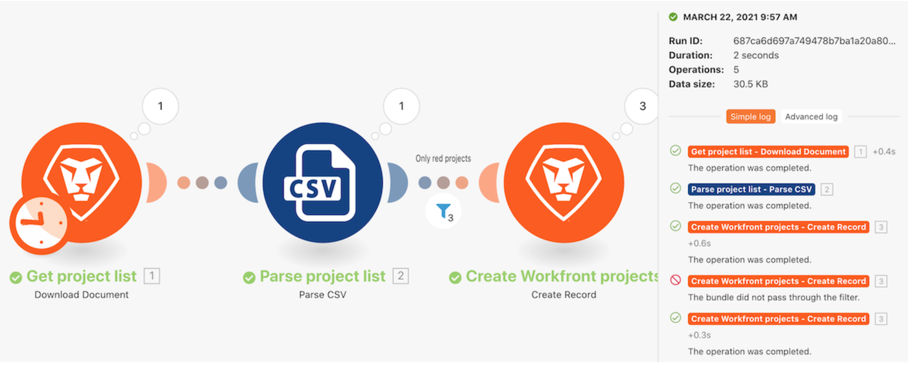

# 実行履歴のチュートリアル

「強力なフィルターの使用」シナリオの実行履歴を確認して、実行時に何が起こったのか、どのような構造で実行されたのかを理解します。

## 実行履歴のチュートリアル

Workfront では、独自の環境で演習を再現する前に、演習のチュートリアルのビデオを見ることをお勧めします。

>[!VIDEO](https://video.tv.adobe.com/v/335283/?quality=12&learn=on&enablevpops=1)

## 「履歴」タブのフルテキスト検索

フルテキスト検索は、シナリオの「履歴」タブで使用でき、シナリオで処理されるデータを検索できます。

フルテキスト検索では、各実行を開いてデータを検索する代わりに、1 つのシナリオ内のすべての実行を対象に検索を行います。 検索結果には、データが見つかった実行のリストが表示されます。詳しくは、任意の実行をクリックして確認できます。

検索結果には、以下の画像に便利なアイコンが含まれています。

A - 実行のステータス。

B - データが検出されたモジュールの入力または出力に含まれていたかどうか。

C - 実行 ID。

D - 実行 ID をコピーします。

実行をクリックすると、Workfront Fusion は実行と、検索結果が見つかったモジュールを読み込みます。 そして、検索データを含むモジュールの実行インスペクターが開きます。

## 詳細情報 以下をお勧めします。

[Workfront Fusion のドキュメント](https://experienceleague.adobe.com/ja/docs/workfront-fusion/using/get-started-with-fusion/understand-workfront-fusion/workfront-fusion-overview)
