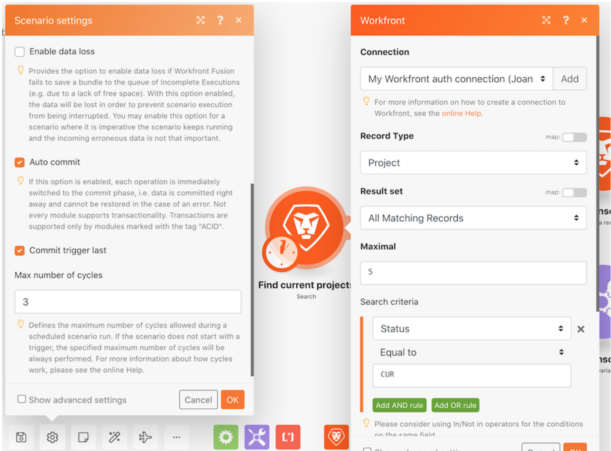

# 実行、サイクル、バンドルのチュートリアル

実行とサイクルを使用して調べる様々なシナリオ設定を実習します。

## 実行、サイクル、バンドルのチュートリアル

Workfront では、独自の環境で演習を再現する前に、演習のチュートリアルのビデオを見ることをお勧めします。

>[!VIDEO](https://video.tv.adobe.com/v/335286/?quality=12&learn=on&enablevpops=1)

## 詳細情報 以下をお勧めします。

[Workfront Fusion のドキュメント](https://experienceleague.adobe.com/ja/docs/workfront-fusion/using/get-started-with-fusion/understand-workfront-fusion/workfront-fusion-overview)
