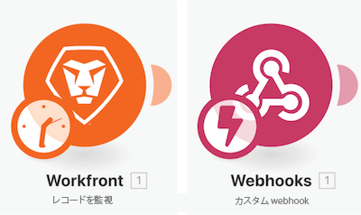
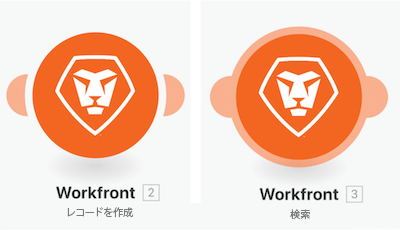

# 追加のアプリと一般的なモジュールについて

## モジュールタイプに関するリマインダー

### トリガーモジュール

最初のモジュールとしてのみ使用でき、集計されない限り、後続のモジュールで個別に処理される 0、1、または複数のバンドルを返すことができます。

* **インスタントトリガー**（Lightning Bolt onトリガー）- Webhook に基づいて直ちにトリガーされます。
* **スケジュールされたトリガー**（Clock on トリガー）- 最後に処理されたレコードを追跡するための特別な機能。

### アクションおよび検索モジュール

* **アクション** - CRUD（作成、読み取り、更新、削除）操作の実行に使用します。
* **検索** - 0 個、1 個または複数のレコードの検索に使用され、集計されない限り、後続のモジュールで個別に処理されるバンドルとしてこれらを返します。

### 追加のアプリと一般的なモジュールについて

このビデオでは、次のことを学習します。

* トリガー、アクション、検索の概要とその違い
* 様々なアプリコネクタにあるモジュールの種類とその機能

>[!VIDEO](https://video.tv.adobe.com/v/335287/?quality=12&learn=on)
