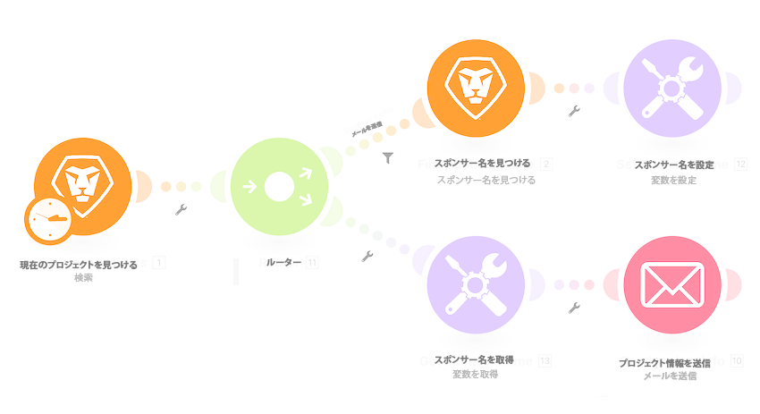

# switch 関数のチュートリアル

単純なデータ変更の場合は、スイッチ関数を使用して、モジュールフィールド内の値を別の値に変換します。この演習では、2 文字のキーを、メールで送信されたプロジェクトの進捗ステータスの実際の名前に変更します。

## switch 関数のチュートリアル

Workfront では、独自の環境で演習を再現する前に、演習のチュートリアルのビデオを見ることをお勧めします。

>[!VIDEO](https://video.tv.adobe.com/v/335289/?quality=12&learn=on)

>[!TIP]
>
>チュートリアルの実施手順については、[switch 関数のチュートリアル](https://experienceleague.adobe.com/docs/workfront-learn/tutorials-workfront/fusion/exercises/switch-function.html?lang=ja)にアクセスしてください。

## 詳細情報 以下をお勧めします。

[Workfront Fusion ドキュメント](https://experienceleague.adobe.com/docs/workfront/using/adobe-workfront-fusion/workfront-fusion-2.html?lang=ja)
