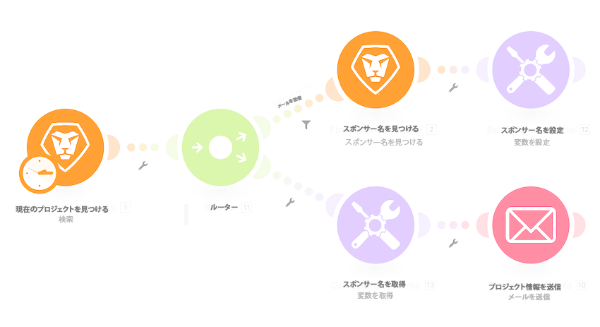

# switch 関数のチュートリアル

単純なデータ変更の場合は、スイッチ関数を使用して、モジュールフィールド内の値を別の値に変換します。 この演習では、2 文字のキーを、メールで送信されたプロジェクトの進捗ステータスの実際の名前に変更します。

## switch 関数のチュートリアル

Workfront では、独自の環境で演習を再現する前に、演習のチュートリアルのビデオを見ることをお勧めします。

>[!VIDEO](https://video.tv.adobe.com/v/3417451/?captions=jpn&quality=12&learn=on&enablevpops=1)

## 詳細情報 以下をお勧めします。

[Workfront Fusion のドキュメント](https://experienceleague.adobe.com/ja/docs/workfront-fusion/using/get-started-with-fusion/understand-workfront-fusion/workfront-fusion-overview)
