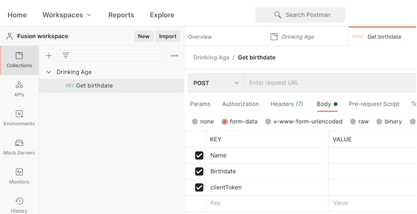

# Webhook のチュートリアル

このシナリオでは、コンビニエンスストアのアプリを作成して、お客様がアルコールを購入できる年齢に達しているかどうかを簡単に判断できるようにします。レジでは、顧客の名前と誕生日および確認済みのクライアントトークンを、指定された URL に投稿するだけです。入力すると、シナリオがトリガーされ、適切な回答を計算してリクエスターに返します。

## Webhook のチュートリアル

Workfront では、独自の環境で演習を再現する前に、演習のチュートリアルのビデオを見ることをお勧めします。

>[!VIDEO](https://video.tv.adobe.com/v/335292/?quality=12&learn=on&enablevpops)

## Postman の設定

このチュートリアルの演習を行うには、無料の Postman アプリケーションをダウンロードする必要があります。以下の手順に従って、演習用の Postman の適切な領域に移動します。

1. ワークスペースを作成し、開きます。
1. 「新規」タブをクリックし、「飲酒年齢」という名前の新しいコレクションを作成します。
1. 「新規」タブを再度クリックし、「誕生日を取得」（GET birthdate）という名前の新しい GET リクエストを作成します。
1. リクエストアクションを GET から POST に変更します。
1. POST の URL フィールドの下にある「本文」サブタブ領域に移動します。
1. 「認証」サブタブの下で「form-data」を選択します。
1. 名前、誕生日、clientToken の 3 つのキーを作成します。

## やってみよう

>[!NOTE]
>
>練習の演習や課題は任意で、Fusion トレーニングを完了するのに必須ではありません。

この練習は、チュートリアルで学習した内容に基づいて構築されますが、ソリューションは提供されていません。

作成された新しい更新を待機している Workfront の Webhook を作成し、日付、更新を行った人の名前、更新内容を記録します。この情報を自分にメール送信します。

**ヒント**：Workfront Watch Eventsトリガーモジュールを使用して、Webhook を作成します。また、Workfront では、更新をメモと呼びます。

**課題**：更新が行われた場所の URL を見つけて追加し、アクセスしやすくできますか？

## 詳細情報 以下をお勧めします。

[Workfront Fusion ドキュメント](https://experienceleague.adobe.com/ja/docs/workfront-fusion/using/get-started-with-fusion/understand-workfront-fusion/workfront-fusion-overview)
