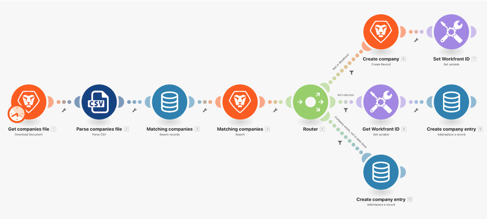

# データストアのチュートリアル

この演習では、データストアを使用して、企業リストと Workfront 間で企業名を同期させます。

これは、Workfront と他のシステムの企業を一方向の同期させるための 1 つのパーツです。 現時点では、CSV ファイルと Workfront の間でのみ同期できます。 ただし、各会社の CSV ファイル（CID）内に Workfront ID（WFID）と会社 ID を管理するテーブルをデータストアに保持します。 これにより、将来的には双方向の同期を実現できる予定です。

## データストアのチュートリアル

Workfront では、独自の環境で演習を再現する前に、演習のチュートリアルのビデオを見ることをお勧めします。

>[!VIDEO](https://video.tv.adobe.com/v/335296/?quality=12&learn=on&enablevpops=1)

## 最終メモ

これでデータ構造とデータストアについて理解したので、今度は「それをいつ使用すべきか」という疑問が湧くかもしれません。

データ構造は、JSON、XML、CSV などのデータ形式をシリアル化したり、解析したりするために一般的によく使用されます。 データ構造を使用すると、データの構造を制御したり、データを検証したりできます。 データ構造を使用する最も一般的な理由は、JSON や XML を期待する API に、有効なデータを作成して送信するためです。 このような場合、JSON アプリまたは XML アプリをデータ構造と共に使用して、データが正しい形式であることを確認する必要があります。

データストアは、複数のシナリオの実行でアクセスする必要がある、永続的なデータの保存にのみ使用する必要があります。 例えば、処理を正確に制御する必要がある高度なユースケースのために、最後に処理されたレコードに関するメタデータを保存できます。

データストアは、データウェアハウスまたはログとして使用するように設計されていません。 データストアには Workfront Fusion 以外ではアクセスできず、データストアとのほとんどのやり取りは Workfront Fusion のシナリオを通じて行われます。 その結果、データウェアハウスやログのユースケースで想定されるような分析またはレポートツールにデータストアを接続することはできません。 このようなユースケースにおける Workfront Fusion の役割は、データの整理と保存に適したシステム（SQL、MariaDB など）を実装することです。

## 詳細情報 以下をお勧めします。

[Workfront Fusion のドキュメント](https://experienceleague.adobe.com/ja/docs/workfront-fusion/using/get-started-with-fusion/understand-workfront-fusion/workfront-fusion-overview)
