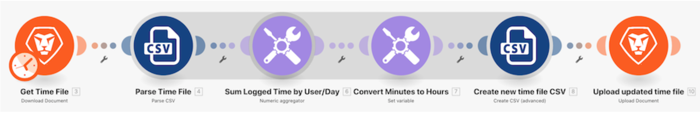

# データ構造のチュートリアル

時間エントリのリストを含む CSV ファイルを開きます。 これらの時間エントリは、複数のユーザーによって特定の日にログ記録された分です。 目標は、この情報を取得して、各ユーザーが毎日ログ記録した合計時間を時間単位で示す新しい CSV を作成することです。

## データ構造のチュートリアル

Workfront では、独自の環境で演習を再現する前に、演習のチュートリアルのビデオを見ることをお勧めします。

>[!VIDEO](https://video.tv.adobe.com/v/335294/?quality=12&learn=on&enablevpops=1)

## 詳細情報 以下をお勧めします。

[Workfront Fusion のドキュメント](https://experienceleague.adobe.com/ja/docs/workfront-fusion/using/get-started-with-fusion/understand-workfront-fusion/workfront-fusion-overview)
