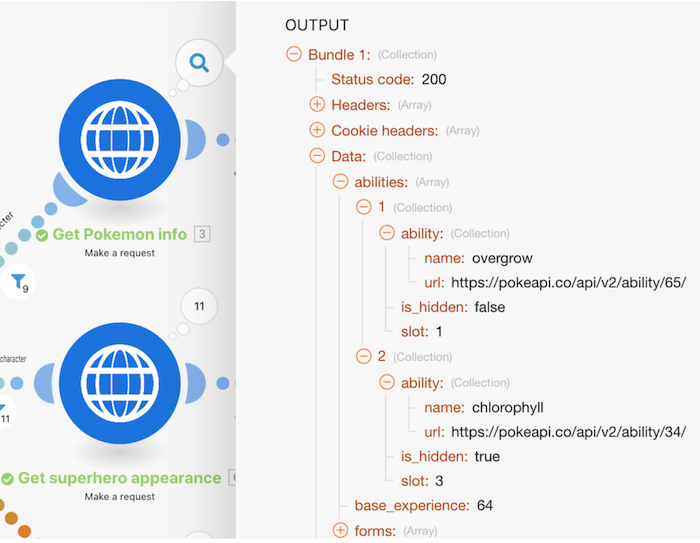

# 配列のチュートリアル

## 概要

単純な配列と複雑な配列を使用した前のチュートリアルの演習を確認してください。 これらの発見方法と、必要に応じて配列関数を使用して情報を活用する方法について見ていきます。

## 配列のチュートリアル

Workfrontは、独自の環境で演習を再作成する前に、演習のチュートリアルのビデオを見ることをお勧めします。

>[!VIDEO](https://video.tv.adobe.com/v/335299/?quality=12)

## 詳細情報 以下をお勧めします。

[Workfront Fusion ドキュメント](https://experienceleague.adobe.com/docs/workfront/using/adobe-workfront-fusion/workfront-fusion-2.html?lang=en)
