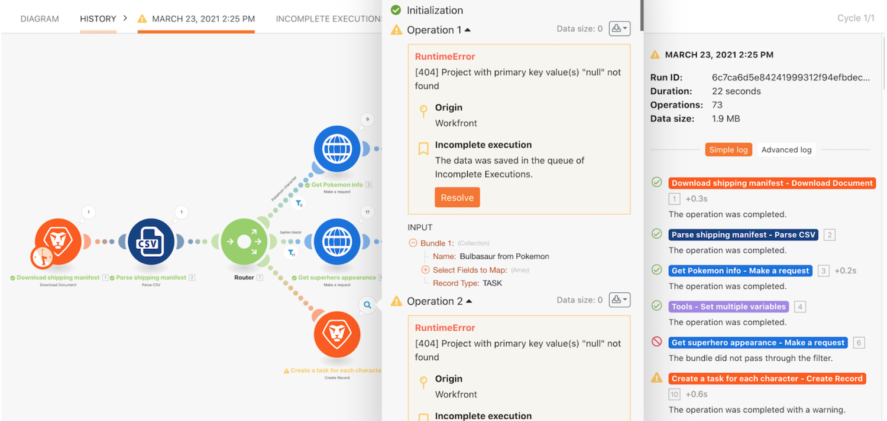

# 不完全な実行のチュートリアル

## 概要

不完全な実行を保存する便利な手順を説明し、エラーを評価して修正した後にバンドルを再実行する際に提供される値について説明します。

## 不完全な実行のチュートリアル

Workfront では、独自の環境で演習を再現する前に、演習のチュートリアルのビデオを見ることをお勧めします。

>[!VIDEO](https://video.tv.adobe.com/v/335308/?quality=12&learn=on)

## 詳細情報 以下をお勧めします。

[Workfront Fusion ドキュメント](https://experienceleague.adobe.com/docs/workfront/using/adobe-workfront-fusion/workfront-fusion-2.html?lang=ja)
