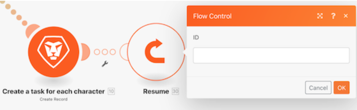
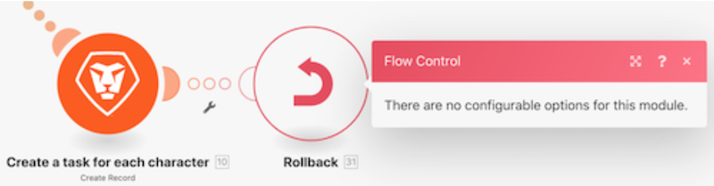

# エラー処理ディレクティブについて

このビデオでは、次のことを学習します。

* 実行を続行できる 3 つのエラーハンドラーディレクティブ
* 実行を停止する 2 つのエラーハンドラーディレクティブ

>[!VIDEO](https://video.tv.adobe.com/v/335305/?quality=12&learn=on&enablevpops=1)

## ディレクティブ - シナリオは続行します

### 再開

* エラーが発生したモジュールに代替出力が指定され、提供されます。
* 以降のモジュールが処理されます。
* シナリオの実行ステータスは「成功」とマークされます。

### 一時停止

* シナリオの実行状態は、不完全な実行のキューに保存されます。このキューでは、エラーを手動で解決できます。 ただし、ここで言及する例外もいくつかあります。
* 後続のモジュールは処理されません。
* 未処理のバンドルがある場合、シナリオの実行は通常どおり続行されます。
* シナリオの実行ステータスは、「警告」とマークされます。

### 無視

* エラーは無視され、後続のモジュールは処理されません。
* 未処理のバンドルがある場合、シナリオの実行は通常どおり続行されます。
* シナリオの実行ステータスは「成功」とマークされます。

## ディレクティブ - シナリオが停止する

### ロールバック

* シナリオの実行は直ちに停止し、すべてのモジュールでロールバックフェーズが開始され、すべてのモジュールが初期状態に戻されます。
* 後続のモジュールは処理されません。
* いくつかのエラータイプがある場合、シナリオは、「シナリオ設定」で指定した「連続エラー数」の後で非アクティブ化されます。
* シナリオの実行ステータスは「エラー」とマークされます。

>[!NOTE]
>
>これは、モジュールにエラーハンドラールートが添付されておらず、「シナリオ」設定の「不完全な実行の保存を許可」設定がオフの場合のデフォルトの動作です。

### コミット

* エラーは無視され、後続のモジュールは処理されません。
* 未処理のバンドルがある場合、シナリオの実行は通常どおり続行されます。
* シナリオの実行ステータスは「成功」とマークされます。

