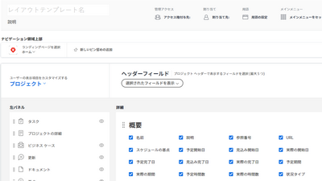
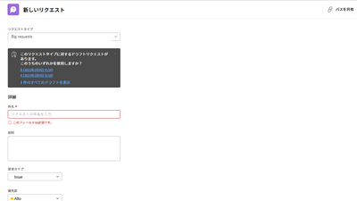
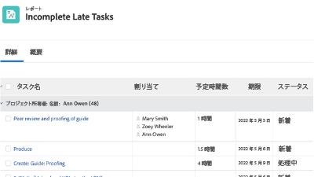

# Workfront チュートリアル {#overview}

Workfront の機能と設定をより深く理解できるように設計されたトレーニングビデオと記事のライブラリ。お客様とお客様の組織の両方が Workfront を使用して成功へつながる、ベストプラクティス、厳選された演習、その他のリソースのコレクションが含まれています。

>[!VIDEO](https://video.tv.adobe.com/v/335063/?quality=12&learn=on)

<!-- 

This is the landing page of the user guide. It should be the first list item in the TOC.md file. 
See other user landing pages to get ideas. 

-->

## スタッフのおすすめ

<table style="margin-top: 0 !important">
  <tr>
   <td>
      
      

         <a href="/help/administration-and-setup/layout-templates/find-layout-templates.md"><strong>レイアウトテンプレートの検索と作成</strong></a>
      

      

         <em>基本的なレイアウトテンプレートの作成方法を説明します。</em>
      

    </td>
   <td>
      
      

         <a href="/help/manage-work/issues-requests/make-a-request.md"><strong>リクエストの作成</strong></a>
      

      

         <em>リクエストの作成、表示、編集方法を説明します。</em>
      

<td>
      
      

         <a href="/help/reporting/basic-reporting/create-a-simple-report.md"><strong>シンプルなレポートの作成</strong></a>
      

      

         <em>シンプルなカスタムレポートの作成方法を説明します。</em>
      

    </td>
  </tr>
</table>

