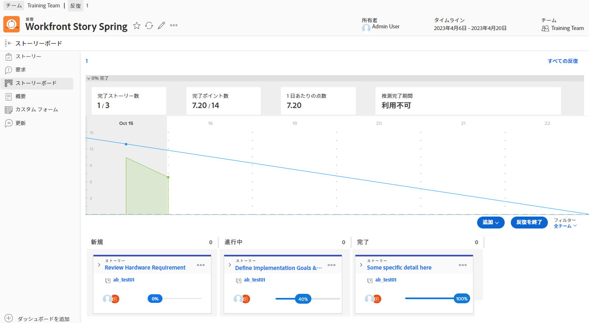
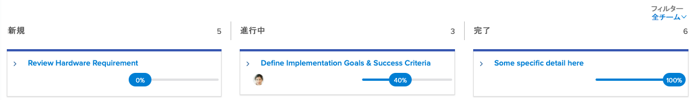

# を使用して表示を作成する [!DNL Jira] 統合

[!DNL Jira]  は、開発チームやテクニカルサポートチームのプロジェクトや問題を追跡するために使用される製品です。 多くのチームは Jira を使用してタスクレベルの進捗状況を追跡しますが、 [!DNL Workfront] プロジェクト管理の概要を把握できるので、真のプロジェクト管理を行うことができます。 を使用 [!DNL Jira]  ネイティブ統合の場合、この情報は 2 つのアプリケーション間で自動的に転送されます。

## 説明 [!DNL Jira] ?

[!DNL Jira]  は、 [!DNL Atlassian] 開発およびテクニカルサポートチームのプロジェクトと問題を追跡する。 多くのチームが [!DNL Jira]  タスクレベルの進捗状況を追跡する場合は、 [!DNL Workfront] プロジェクトを管理する。 つまり、チームは [!DNL Workfront] および [!DNL Jira] . しかし [!DNL Jira]  ネイティブ統合と呼ばれる場合、この種の情報は自動的に 2 つのアプリケーション間で転送されます。

## 機能 [!DNL Jira]  統合の方法

ここにスプリントが入っています [!DNL Workfront] タイトル付き&quot;[!DNL Workfront] 物語の春」

Dev-Jedi Council Agile チームの Joan Harris は、スクリムボードとバーンダウンチャートを使用して、スプリント全体の進行状況を測定します。 チームは、何が起きているかを視覚的に表現します。 さらに、この情報は、四半期ごとにレビューされるエグゼクティブレポートに送られます。 ただし、ほとんどのチームが [!DNL Jira] ではない [!DNL Workfront].

Joan のチームは [!DNL Jira]  数年の間、作業に割り当てられた個々のタスクやバグを追跡するのに適した方法を見つけ出すことができます。 しかしジョアンには、 [!DNL Workfront] 最終的には、エグゼクティブレポートに入力します。

を通じて [!DNL Jira]  ネイティブ統合、タスク、ストーリー、バグに対しておこなわれた更新により、 [!DNL Workfront].

そのため、[ ハードウェア要件の確認 ] ストーリーに割り当てられたチームメンバーが、 [!DNL Jira] をクリックし、「新規」から「処理中」に移動すると、更新により、 [!DNL Workfront] 同様に。

