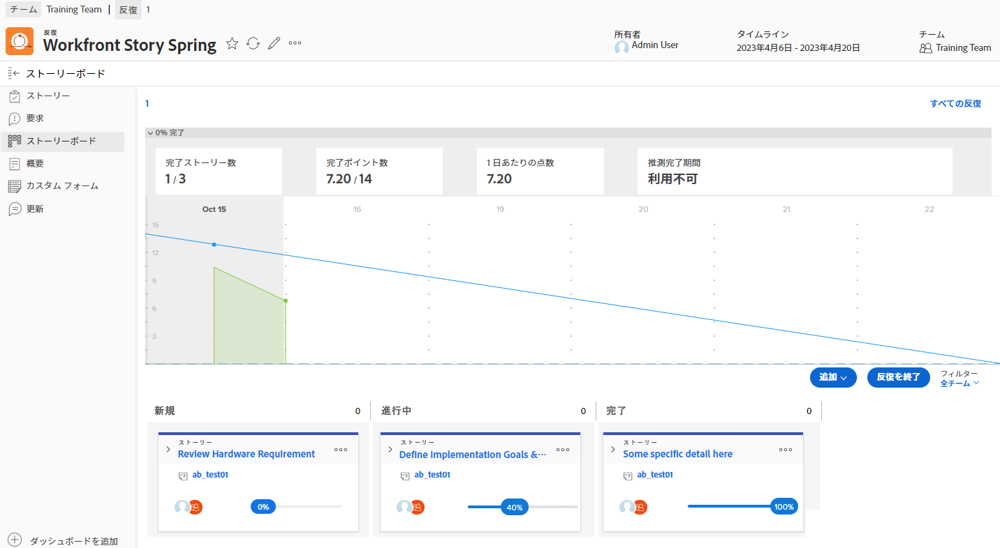
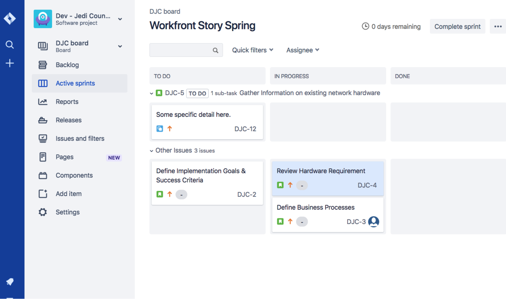
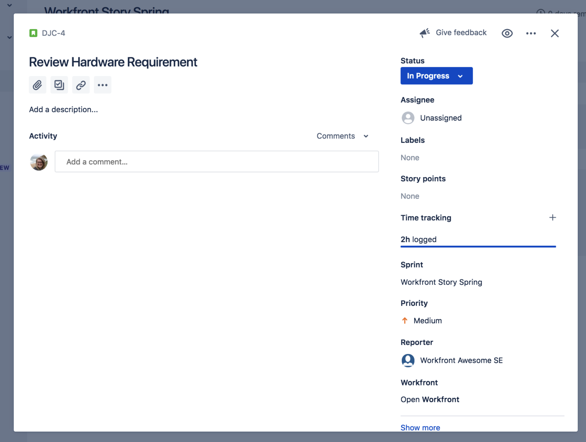
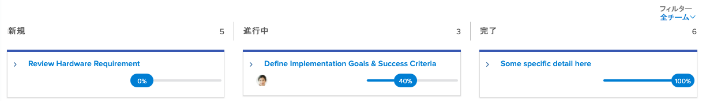

# [!DNL Jira] 統合による表示の作成

[!DNL Jira] という製品を使用すると、開発チームや技術サポートチームのプロジェクトやイシューをトラッキングできます。 多くのチームは Jira を使用してタスクレベルの進捗を追跡していますが、[!DNL Workfront] を使用するとハイレベルの進捗を表示できるので、真のプロジェクト管理を行うことができます。 [!DNL Jira] のネイティブ統合により、この情報は 2 つのアプリケーション間で自動的に転送されます。

## [!DNL Jira] とは

[!DNL Jira] は [!DNL Atlassian] が作成した製品で、開発チームと技術サポートチームのプロジェクトとイシューをトラッキングできます。 多くのチームは [!DNL Jira] を使用してタスクレベルの進捗を追跡していますが、[!DNL Workfront] も使用してプロジェクトを管理しています。 つまり、[!DNL Workfront] と [!DNL Jira] の両方でタスクを作成することで、チームは二重の努力をすることになります。 ただし、[!DNL Jira] のネイティブ統合により、そのような情報は 2 つのアプリケーション間で自動的に転送されます。

## Adobe Workfront for Jira のインストール方法

[Adobe Workfront for Jira](https://experienceleague.adobe.com/docs/workfront/using/adobe-workfront-integrations/workfront-for-jira/workfront-for-jira.html?lang=ja) に移動し、Adobe Workfront for Jira のインストールと設定の方法を学びます。

## [!DNL Jira] の統合でできること

ここでは、[!DNL Workfront] に「[!DNL Workfront] ストーリー春」というタイトルのスプリントがあります。

Dev-Jedi Council Agile チームの Joan Harris は、スクラムボードとバーンダウンチャートを使用して、スプリント全体の進捗を測定します。 チームは、何が起きているかを視覚的に把握できます。 さらに、この情報は、四半期ごとにレビューされる役員報告に反映されます。 ただし、ほとんどのチームは [!DNL Workfront] ではなく [!DNL Jira] で更新を行います。

Joan のチームは数年間 [!DNL Jira] を使用しており、作業を割り当てられた個々のタスクやバグを追跡するのに良い方法であると感じています。 ただし、Joan が本当に必要としているのは、[!DNL Workfront] に接続し、最終的に役員報告に反映するための情報です。

[!DNL Jira] のネイティブ統合により、タスク、ストーリー、バグに加えられた更新で、[!DNL Workfront] のタスク、ストーリー、イシューを自動的に更新できます。

そのため、ハードウェア要件のレビューストーリーを担当するチームメンバーが、[!DNL Jira] のステータスを更新して「新規」から「処理中」に変更すると、その更新によって [!DNL Workfront] のストーリーも自動的に変更されます。

