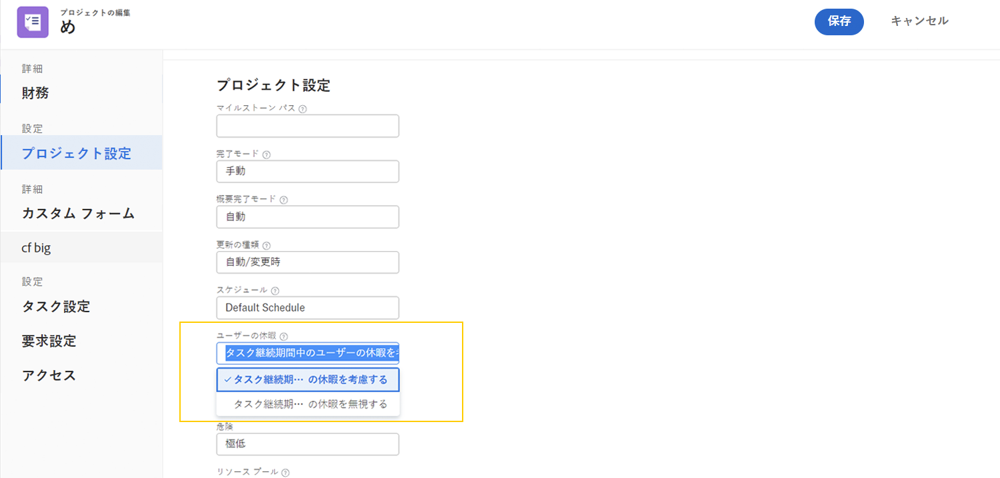
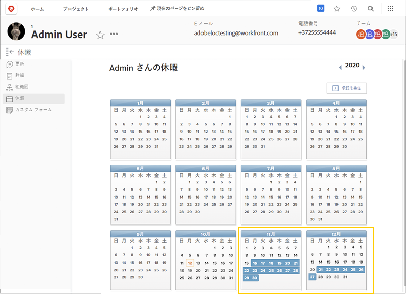
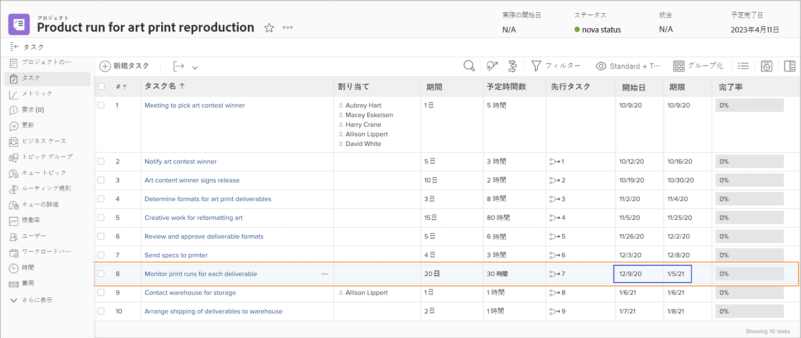
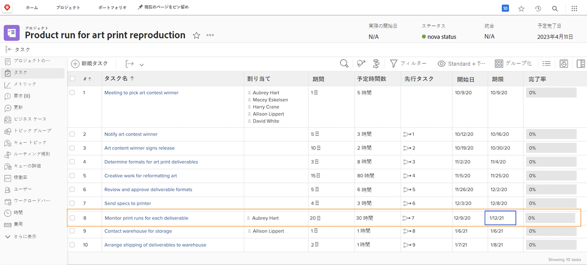
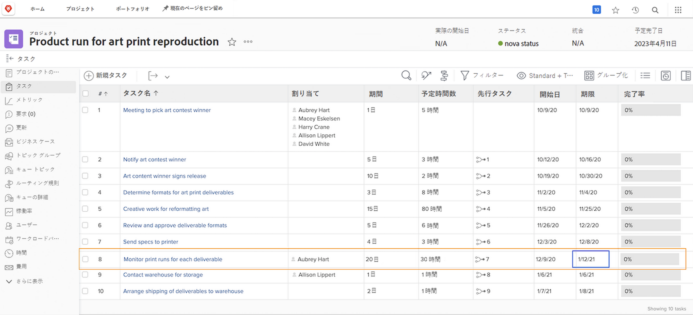

# 休暇がプロジェクトのタイムラインに与える影響

割り当てられたユーザーの休暇がプロジェクトのタイムラインに影響を与えるかどうかは、[!UICONTROL ユーザーの休暇]と呼ばれるプロジェクト設定によって決まります。この設定は、タスクのプライマリ担当者の休暇をそのタスクの予定日をプロジェクト上で調整するかどうかを決定します。

[!UICONTROL タスク継続期間中のユーザーの休暇を考慮する]または[!UICONTROL タスク継続期間中のユーザーの休暇を無視する]の各設定を選択した場合、プロジェクトのタイムラインで何が起こるかを見てみましょう。

## タスク継続期間中のユーザーの休暇を考慮する

このオプションは、Workfront のデフォルト設定です。

この例では、タスクのプライマリ担当者は、個人用カレンダーで休日がマークされています。

プロジェクトマネージャーは、このユーザーを、ユーザーの休暇と予定日が重なるタスクに割り当てようとしています。

このユーザーがタスクに割り当てられると、予定日が自動的に調整されます。現在は、タスクの予定完了日が数日延長され、ユーザーの休暇に対応できるようになりました。この変更は、プロジェクト内の他のタスクの予定日や、プロジェクトの予定完了日に影響を与える可能性があることに注意する必要があります。

## [!UICONTROL タスク継続期間中のユーザーの休暇を無視する]

このオプションを選択した場合、プライマリ担当者がそのタスクの期間中に休暇を取っている場合でも、タスクの予定日は当初の予定のままになります。

チームメンバーには、カレンダーに休日のマークが付いています。

プロジェクトマネージャーは、休暇を重なるタスクを割り当てます。ユーザーが割り当てられると、タスクの予定日は当初の予定通りになります。

作業が予定どおりに完了するようにするには、元の担当者が不在の間にタスクを行うことができる別のユーザーを割り当てることをお勧めします。

## プロジェクトレベルで設定を調整

プロジェクトのユーザーの休暇設定を変更するには、次の手順に従います。

* Workfront でプロジェクト名をクリックして、プロジェクトを開きます。

* ページヘッダーの 3 ドットメニューからプロジェクト名の右にある「[!UICONTROL 編集]」を選択します。

* 「[!UICONTROL プロジェクト設定]」セクションにスクロールして、「[!UICONTROL ユーザーの休暇]」フィールドを見つけます。

* [!UICONTROL タスク継続期間中のユーザーの休暇を考慮する]または[!UICONTROL タスク継続期間中のユーザーの休暇を無視する]から、このプロジェクトに適用するオプションを選択します。

* ウィンドウの右上隅にある「[!UICONTROL 保存]」ボタンをクリックします。

**メモ**：この設定は、プロジェクトページの左パネルメニューの「[!UICONTROL プロジェクト詳細]」を選択すると利用できません。

このグローバル設定は、[!UICONTROL 設定]メニューのプロジェクト環境設定にあります。この設定は、システム管理者が管理します。グループ管理者は、管理するグループに対してこの設定を調整できます。

Workfront では、大部分のプロジェクトに対して組織で休暇を処理する方法を設定することをお勧めします。

この設定は、テンプレートの詳細を使用して、プロジェクトテンプレートに組み込むこともできます。
