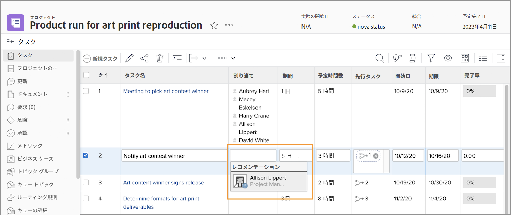
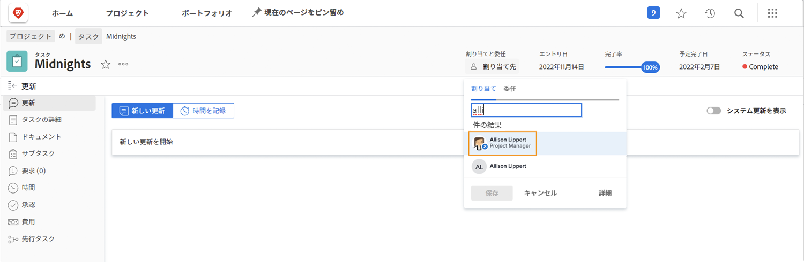

# タスクの割り当て時の休暇の表示

小さなアイコンは、ユーザーを割り当てようとしているタスクの期間内には、個人のカレンダーにマークされている休暇がユーザーにあることを示します。

プロジェクトプランからユーザーの名前を入力して割り当てを行っている場合は、その名前がグレー表示になり、アバター画像の横に小さな青い警告アイコンが表示されます。

タスクページのヘッダーから割り当てを行っている場合は、そのタスクの期間内に休暇を取ることを知らせるために、そのユーザーのアバターの横に小さな青い飛行機のアイコンが表示されます。

