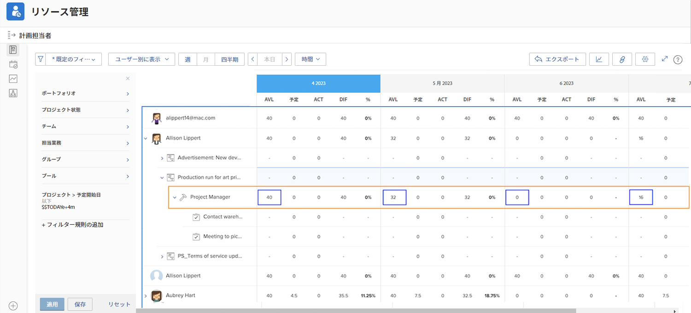

# リソース管理ツールでの表示

リソースの計画と管理にとって、誰がいつ利用できるかを把握することが不可欠です。 ユーザーがWorkfrontのカレンダーで自分の休日をマークすると、その情報はWorkfrontのリソースツールでも確認できます。

## リソースプランナー

ユーザーのオフ時間は、リソースプランナーの「利用可能 (AVL) 」列に反映されます。 Workfrontは、割り当てられたスケジュール、ジョブロールの割合などに基づいてWorkfrontが計算する、使用可能な時間からカレンダーにマークされたオフ時間を引きます。

## ワークロードバランサー

ワークロード・バランサでは、タイムオフはカレンダに灰色のバーで表示されます。 この表示設定により、リソースマネージャや他のユーザーが作業を割り当てる際に、より十分な情報に基づいた意思決定を行うことができます。

ただし、タイムオフインジケータは、ワークロードバランサーを通じてユーザーに作業を割り当てることを妨げません。 作業が割り当てられている場合、ワークロード・バランサは、その人物がオフ期間中に過剰に割り当てられていることを示します。

