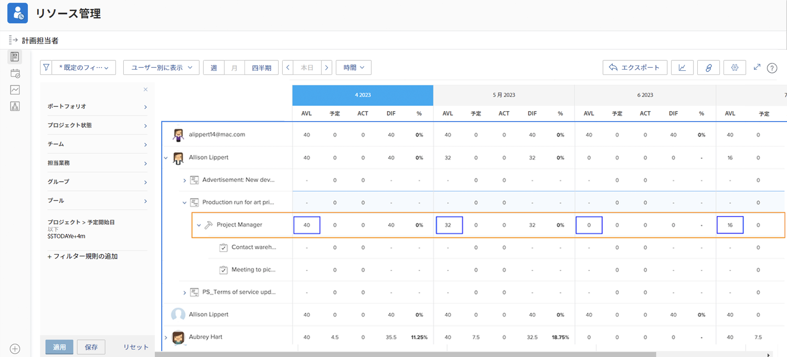
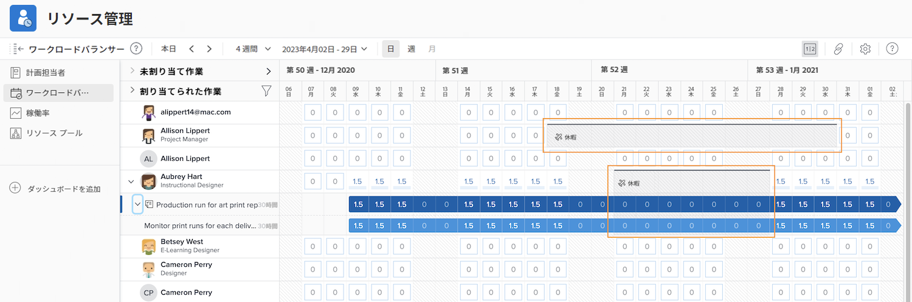

# リソース管理ツールでの表示

リソースの計画と管理にとって、誰がいつ対応できるかを把握することが不可欠です。 ユーザーが Workfront のカレンダーで自分の休日をマークすると、その情報は Workfront のリソースツールでも確認できます。

## リソースプランナー

ユーザーの休暇は、リソースプランナーの「作業可能（AVL）」列に反映されます。 Workfront は、割り当てられたスケジュール、担当業務の割合などに基づいて Workfront が計算した作業可能時間からカレンダーにマークされた休暇を引きます。

## ワークロードバランサー

ワークロードバランサーでは、休暇はカレンダーに灰色のバーで表示されます。 この表示により、リソース管理者や他のユーザーが作業を割り当てる際に、より十分な情報に基づいた意思決定を行うことができます。

ただし、休暇インジケーターは、ワークロードバランサーを通じてユーザーに作業を割り当てることを妨げません。 作業が割り当てられた場合、ワークロードバランサーは、その人物が休暇期間中に過剰に割り当てられていることを示します。

