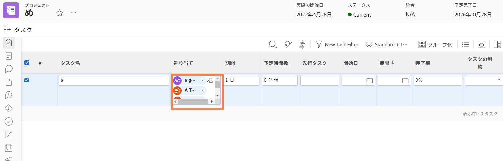
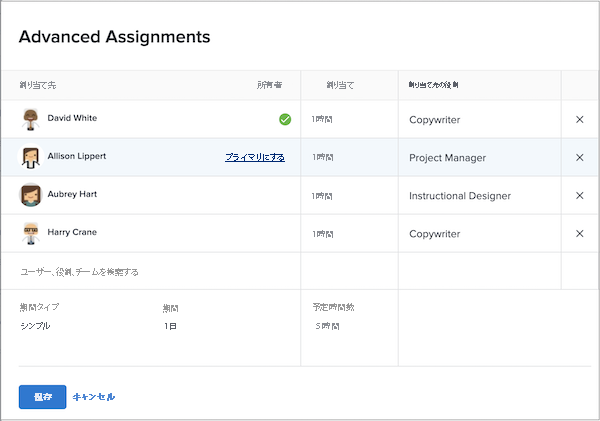
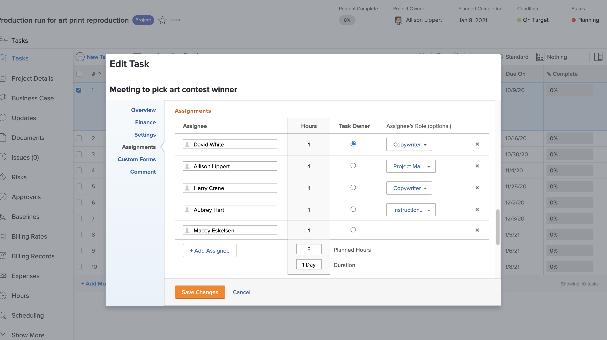

# プライマリ担当者とは

プライマリ担当者が存在するのは、1 つのタスクに複数のユーザーが割り当てられている場合です。 Workfront は「ユーザーの休暇」設定を適用するときに、プライマリ担当者の休暇カレンダーを参照します。

誰がプライマリ担当者かは、プロジェクトページで確認できます。 「割り当て」フィールドをクリックし、隅にある「詳細な割り当て」アイコンをクリックします。

「詳細な割り当て」ウィンドウを開くと、プライマリ担当者（タスク責任者）には緑色のチェックマークが付いています。 別のユーザーの上にカーソルを合わせて「プライマリにする」リンクをクリックすると、タスク責任者を変更できます。

プライマリ担当者はタスクページから変更することもできます。 プロジェクト一覧のタスクのチェックボックスをオンにし、編集アイコンをクリックします。 「割り当て」セクションまでスクロールし、ボタンをクリックしてタスク責任者を指定します。

