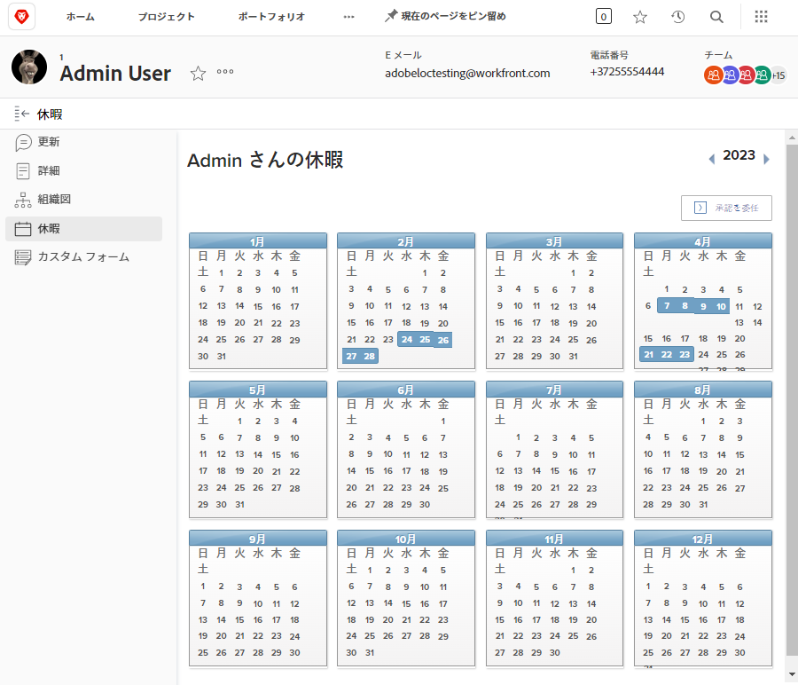
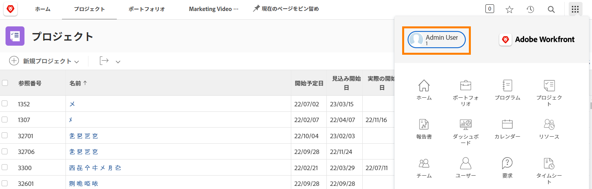
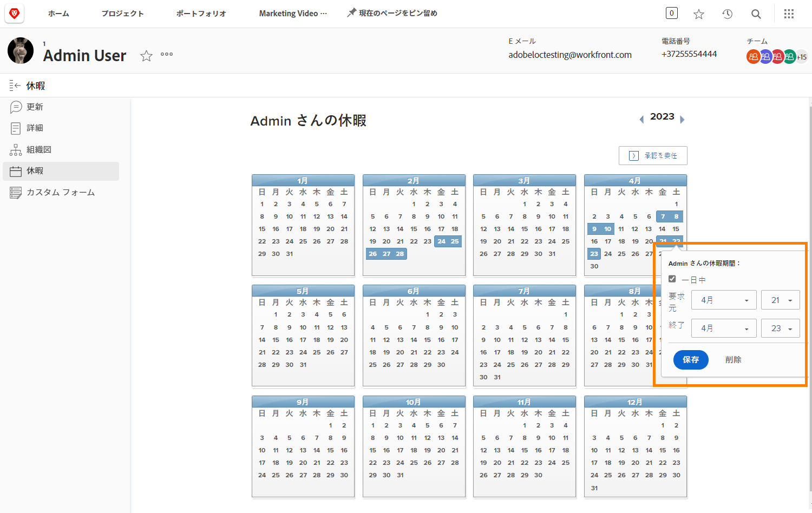

# 休暇カレンダーを使用する理由

プランナーとプロジェクトマネージャーが Workfront でタスクを割り当てると、割り当てられた作業を完了できるチームメンバーを把握でき、プロジェクトを予定どおりに完了できます。

また、リソースマネージャーが Workfront のリソース計画および管理ツールで割り当てを確認する際に、正確な可用性データが現在および将来の作業計画に反映されます。

Workfront ワークとプランライセンスのユーザーは、個人休暇カレンダーを使用して、通常の勤務時間内の勤務不可の時間帯を示すことができます。 半日の休みでも、割り当てられたタスクの完了に影響があります。

**メモ**：Workfront は、個人の休暇を管理、累積、または追跡するために、組織の既存システムを複製または置き換えるようには設計されていません。 休暇のリクエストと管理に関する組織のガイドラインに従います。

## 休暇をマーク

個人の休暇カレンダーは、Workfront のユーザーページに表示され、メインメニューからアクセスできます。 左隅の自分の名前をクリックします。

* Workfront のユーザーページの左パネルのメニューで「休暇」をクリックします。

* デフォルトでは、現在の年が表示されます。 必要に応じて、矢印を使用して別の年を選択します（カレンダーウィンドウの右上）。

* カレンダー上の日付をクリックします。

* Workfront は、1 日休暇を取ると仮定します。その場合は、「保存」ボタンをクリックします。

* 連続してもう 1 日休暇を取る場合は、終了日を最後の不在となる日に変更します。「保存」ボタンをクリックします。

* 休暇が丸 1 日ではない場合は、「終日」ボックスのチェックを外します。 次に、その日の勤務時間（勤務可能な時間）を指定します。 「保存」ボタンをクリックします。

休暇は、カレンダー上に青いボックスで示されます。 この休暇は、プロジェクトやリソースの計画を支援するために Workfront の他の場所にも表示されます。

**ヒント**：タスクが既に割り当てられている場合、カレンダーで休暇をマークしても、勤務できないことを知らせる通知はプロジェクトマネージャーに送信されません。 現在のプロジェクトや割り当てられた作業に影響を与える可能性のある新しい休暇については、プロジェクトマネージャーに必ず知らせてください。
