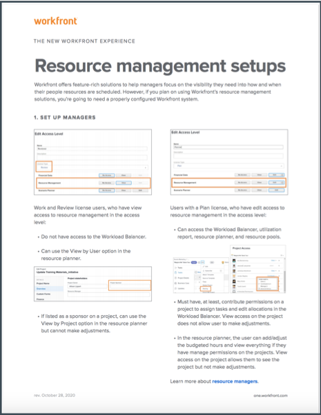
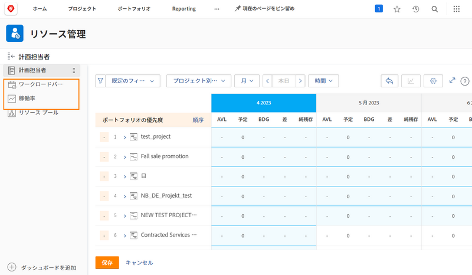

# リソース管理の設定、ワークロードバランサー、稼働率レポート

[!DNL Workfront] は、[!DNL Workfront] の複数のツール間でデータを提供し、リソースの決定を容易にし、プロセスをよりスムーズにするのに役立ちます。リソースで進捗を確認するには、管理者、ユーザー、プロジェクトが適切に設定されていることを確認する必要があります。 これらの設定は、すべての [!DNL Workfront’s] リソース管理ツールを使用するプランがない場合でも役立ちます。

この節では、以下について説明します。

* 適切なアクセス権を持つリソース管理者を設定する方法
* ワークロードバランサーと稼働率レポートを表示する方法

## リソース管理の設定

まず、適切なユーザーが組織のリソースにアクセスして管理できるようにすることから始めましょう。

&lt;!段階的な手順については、ガイドをダウンロードしてください。&gt;

## ワークロードバランサーと稼働率レポート

アクセスレベルで編集権限が付与されている場合、ユーザーはリソースプランナーとリソースプールと共に、ワークロードバランサーや稼働率レポートなどの追加ツールにアクセスできます。

これらのツールを使用してリソースにアクセスしたり、リソースを管理したりするために必要なその他の設定はありません。

