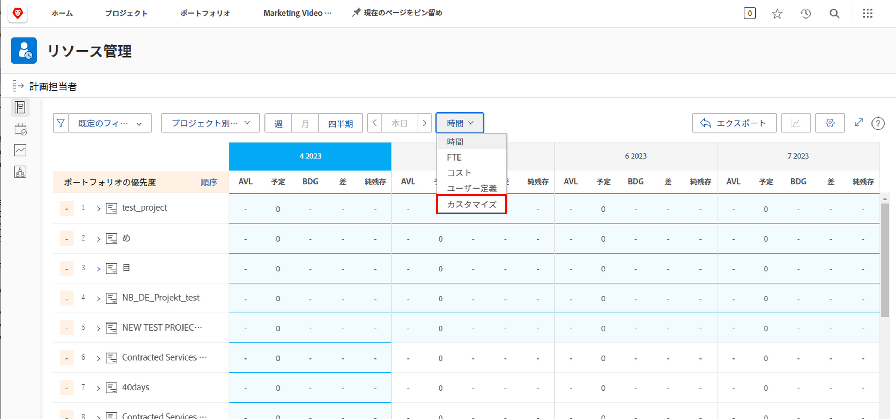
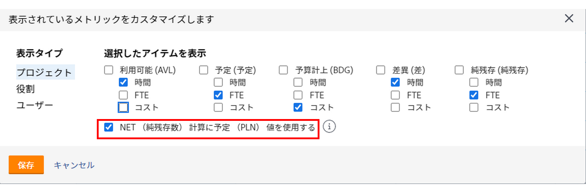
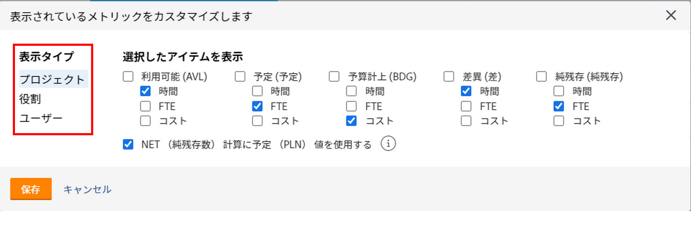
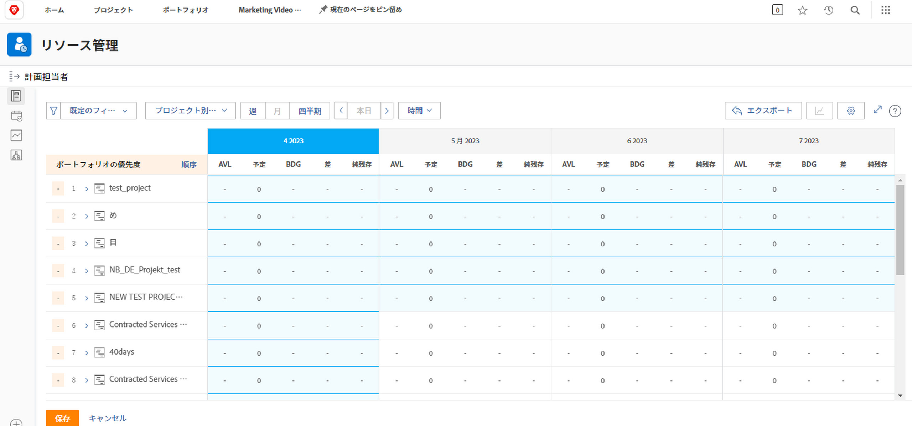

# でのジョブの役割別に表示 [!DNL Resource Planner]

このビデオでは、次の操作を実行します。

* 詳しくは、 [!UICONTROL ジョブの役割別に表示 ]表示
* このビューでのリソース情報の表示方法を説明します

>[!VIDEO](https://video.tv.adobe.com/v/335169/?quality=12)

「役割別に表示」オプションのデフォルトでは、「予算」列が表示されます。この列は、プロジェクトに必要な推定リソース数をビジネス事例から取り込みます（入力済みの場合）。 また、「Net」列は、デフォルトで、「Budgeted」列の数値を使用して残りのリソース数を示します。

ただし、組織がこれらの金額を見積もるためにビジネスケースを使用していない、または使用する準備ができていない場合があります。 代わりに、プロジェクトに既に入力されている予定時間を使用します。 「カスタマイズ」オプションを使用して、選択したビューに表示する列と「ネット」列の計算方法を選択できます。

表示される列と Net 列の計算を、予定時間に基づいて変更するには、次の手順に従います。

* [ 時間 ] ドロップダウンメニューをクリックし、[ カスタマイズ ] を選択します。

* 「表示される指標をカスタマイズ」ボックスで、表示する列を決定し、「NET 計算で計画済 (PLN) 値を使用」の横にあるチェックボックスをオンにします。

**注意**:「生産資源プランナ」の様々なビュー・タイプの列と計算を編集するには、ボックスの左側にあるオプションを選択します。

* 「保存」をクリックすると、ボックスが閉じ、画面が更新されます。

「生産資源プランナ」には、複雑なスプレッドシートやラウンド・ロビン通信を使用せずに、需要と供給に関して知っておく必要がある情報が表示されます。

手元の情報とツールを使用して、チームの能力を微調整し、自分にとって重要な作業を実行できます。
