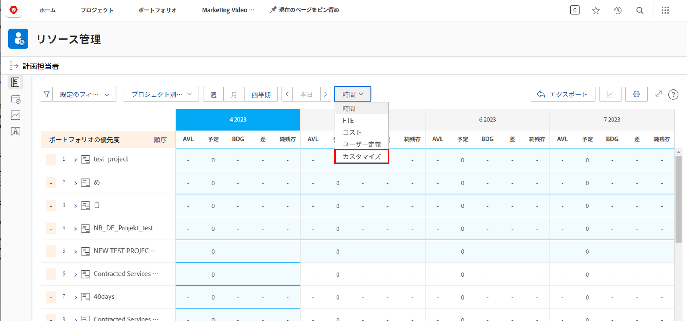
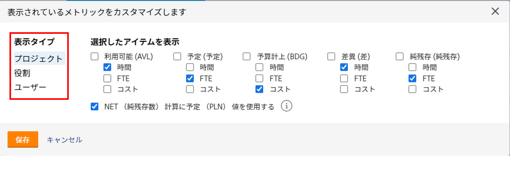
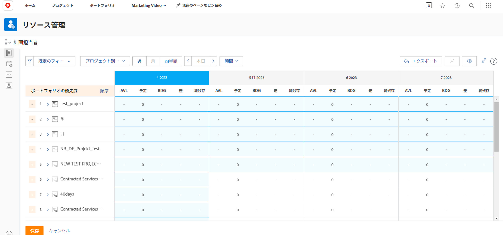

# [!DNL Resource Planner] でプロジェクト別に表示

このビデオでは、次の操作を実行します。

* [!UICONTROL プロジェクト別に表示]ビューを確認する
* そのビューにリソース情報を表示する方法を確認する

>[!VIDEO](https://video.tv.adobe.com/v/335170/?quality=12)

「プロジェクト別に表示」オプションのデフォルトでは予算列が表示され、プロジェクトに必要な推定リソース数がビジネスケースから取り込まれます（入力済みの場合）。これは、「予算」列の数値を使用して、デフォルトで「NET」列に残りのリソースの数が示されることも意味します。

ただし、組織がこれらの金額を見積もるビジネスケースを実施していなかったり、実施する準備ができていない可能性があります。代わりに、プロジェクトに既に入力されている予定時間数を使用します。「カスタマイズ」オプションを使用すると、選択したビューに表示する列と「NET」列の計算方法を選択できます。

表示される列と「ネット」列の計算を、予定時間数に基づくように変更するには、次の手順に従います。

* 「時間」ドロップダウンメニューをクリックして「カスタマイズ」を選択します。

* 「表示される指標をカスタマイズ」ボックスで、表示する列を確認し、「NET 計算で予定（PLN）値を使用」の横にあるチェックボックスをオンにします。

**メモ**：リソースプランナーの様々な表示タイプについて列と計算を編集するには、ボックスの左側にあるオプションを選択します。

* 「保存」をクリックすると、ボックスが閉じて画面が更新されます。

リソースプランナーには、複雑なスプレッドシートを使用したり総当たり的なやりとりを行うことなく、需要と供給に関して知っておくべき情報が表示されます。

手元の情報とツールを使用することにより、チームの処理能力を微調整し、重要な作業を遂行できます。
