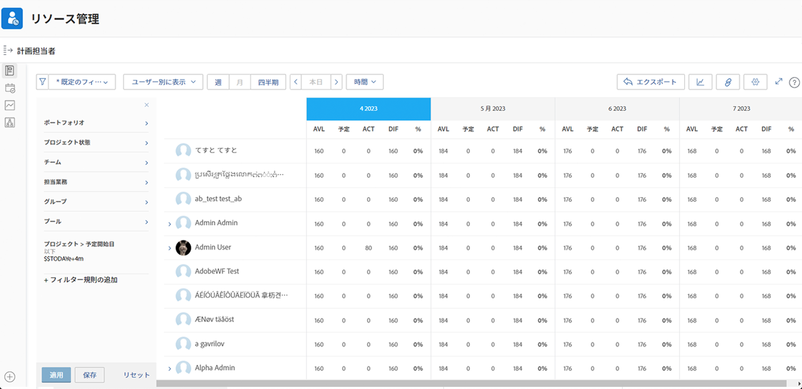

# 稼動率の表示とリソースプランナーのフィルタリング

リソースプランナーを使用すると、関心のあるプロジェクトを明確に把握し、それを実行するために必要な人員の状況をリアルタイムで確認できます。

* 例えば、最新のサーバー更新の取り組みが最優先になった場合、処理能力がどうなるかを知りたいとします。

* リソースプランナーは、従業員の稼働率や、あるプロジェクトにリソースを割り当てた場合、優先度の低いプロジェクトの稼働率にどのような影響を与えるかを表示します。

リソース配分が現在の作業にどのように影響するかを確認できるだけでなく、当面のリソーススケジューリングのニーズを超えて、長期的なリソース配分を評価し、個人が過剰に（または過少に）割り当てられていないかどうかを判断できようになります。

## リソースプランナーのフィルタリング

リソースプランナーは、一連のデフォルトのフィルターで自動的に開きます。これらのフィルターは以下を編集できます。

* 時間枠
* ポートフォリオまたはプログラム
* リソースプールなど

これにより、どのリソースがいつ利用可能であるかに焦点を当てることができます。
