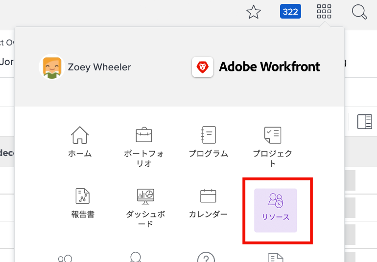
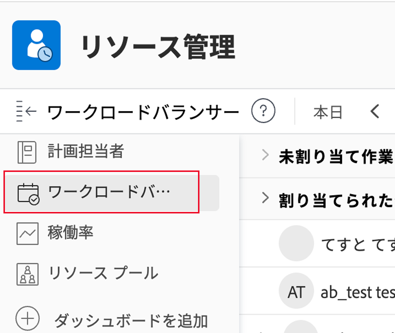
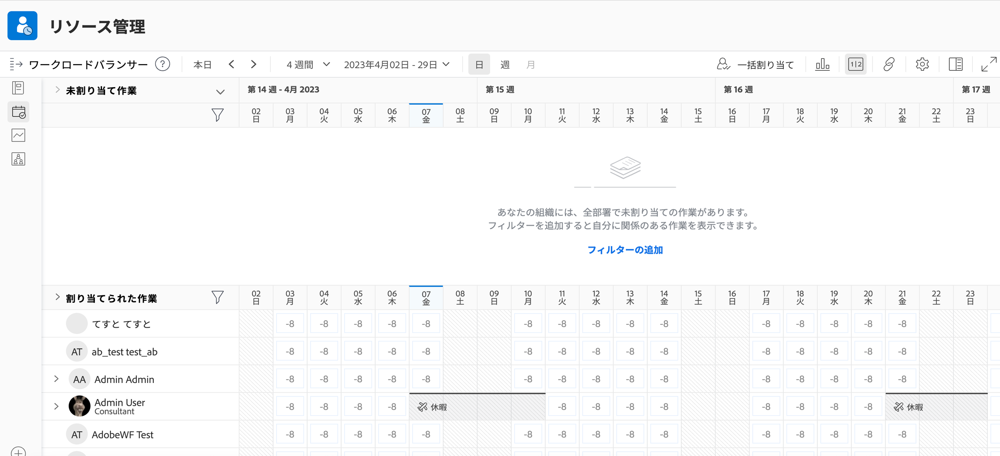
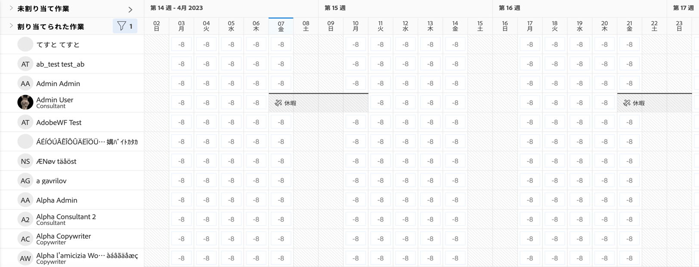
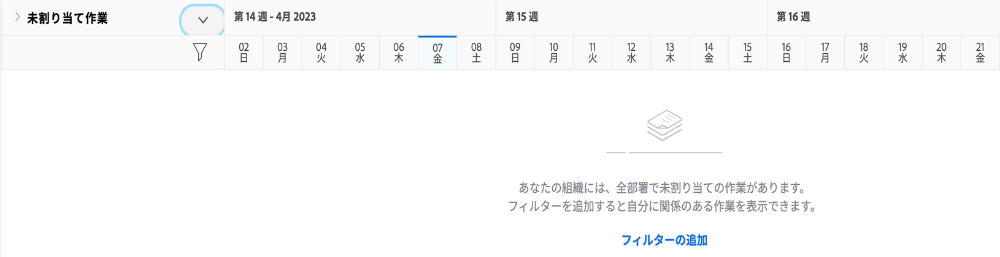

# [!DNL Workload Balancer] の検索

使用可能なリソースとその分布方法を把握することは、どのユーザーにとっても困難な作業です。 だからこそ、Workfront では、[!DNL Workload Balancer] を作成しました。

その目的は、管理する人物の日次および週次のワークロードをより深く理解し、管理できるようにすることです。 これにより、複数のプロジェクトにわたって、役割と可用性に基づいて、より適切な割り当てを行うことができます。

* [!UICONTROL メインメニュー]で「[!UICONTROL リソース]」をクリックします。
* リソース管理エリアの「[!UICONTROL スケジュール]」セクションに移動します。
* 表示される「[!UICONTROL ワークロードバランサー]」セクションをクリックします。

## ワークロードバランサー内のエリア

[!DNL Workload Balancer] には、割り当てられた作業と未割り当ての作業の 2 つのセクションが表示されます。

割り当てられた作業エリアには、ユーザーのリストと、Workfront 内で既に割り当てられている作業が表示されます。 デフォルトでは、このエリアは、所属する Workfront チームの一部であるユーザーにフィルタリングされます。 このようにして、どのチームメンバーが作業に割り当てられているかを確認できます。

未割り当てエリアには、個人、担当業務、チームに割り当てられる必要がある作業が表示されます。 ただし、最初は、このエリアには何も表示されません。

未割り当て作業エリアを空白にして開始することで、割り当てを行う前に、割り当てられた作業エリアで、ユーザーの現在のワークロードに最初に焦点を当てることができます。
