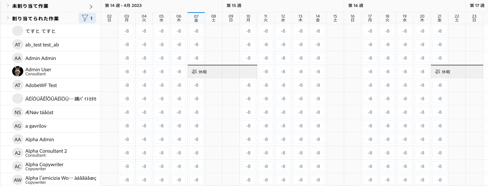

# 次を検索： [!DNL Workload Balancer]

利用可能なリソースとその配布方法を知ることは、誰にとっても困難な作業です。 Workfrontが [!DNL Workload Balancer].

その目的は、管理する人々の日次および週次のワークロードに関するより詳細なインサイトと管理を提供することです。 これにより、複数のプロジェクトにわたって、役割と可用性に基づいて、より適切な割り当てをおこなうことができます。

* クリック [!UICONTROL リソース] 内 [!UICONTROL メインメニュー].
* 次に移動： [!UICONTROL スケジュール] 」セクションに表示されます。
* 次をクリック： [!UICONTROL &quot;ワークロード・バランサに切り替え&quot;] リンク。

この [!DNL Workload Balancer] は、Workfrontツールの「リソース管理」領域に移動する場合のデフォルトのオプションです。

## ワークロードバランサー内の領域

2 つのセクションが [!DNL Workload Balancer]:割り当て作業と未割り当て作業。

割り当てられた作業領域には、ユーザーと、Workfront内で既に割り当てられている作業のリストが表示されます。 デフォルトでは、この領域は、所属するWorkfrontチームに属するユーザーに対してフィルタリングされます。 これにより、どのチームメンバーが作業に割り当てられたかを確認できます。

「未割り当て作業」領域には、個人、職務、チームのどれに対しても、割り当てが必要な作業が表示されます。 ただし、最初は、この領域には何も表示されません。

「未割り当て作業領域」を空白のままにすると、割り当てを行う前に、「割り当て済み作業領域」で、ユーザーの現在の作業負荷に最初に焦点を当てることができます。
