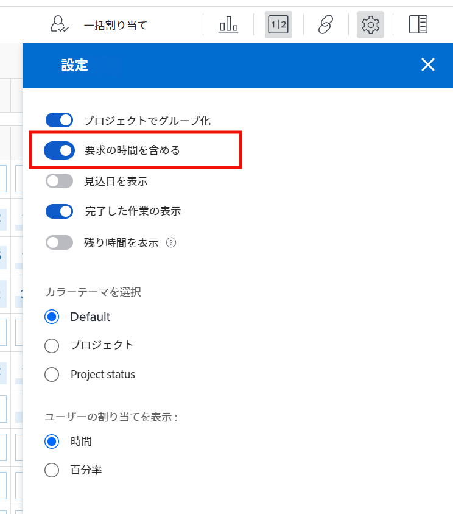
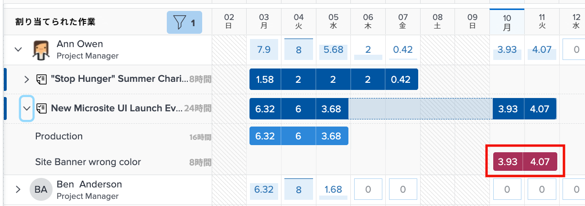
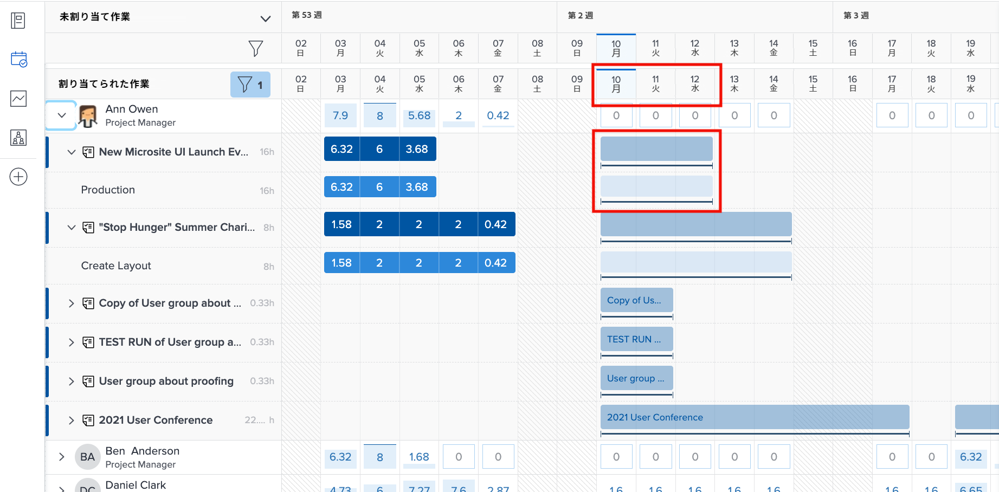
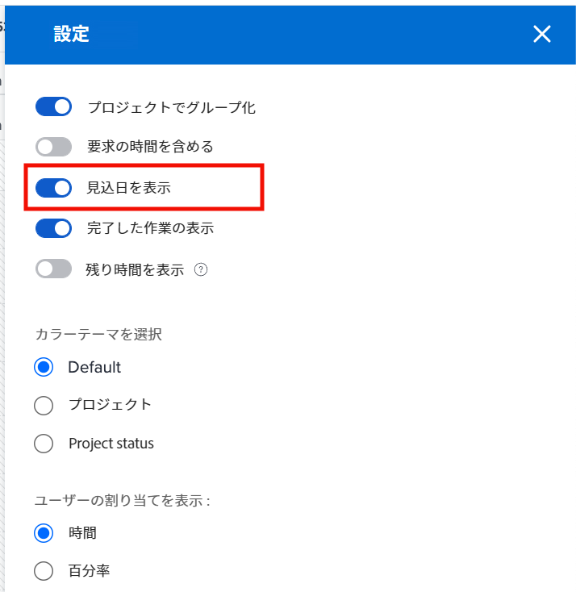
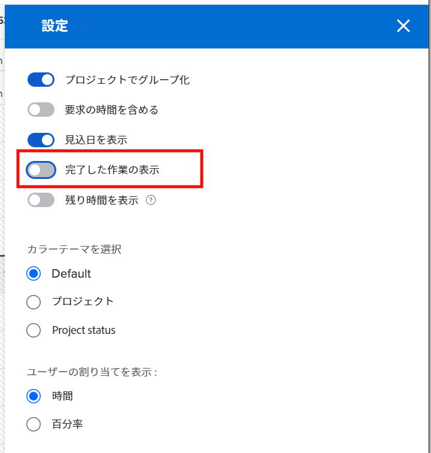

# ワークロードバランサーで考慮すべき設定

ユーザーの個々のワークロードを詳しく調べる際に考慮すべきワークロードバランサーの設定がいくつかあります。

* イシューの割り当て
* 見込み日
* 完了した作業

これらは、ワークロードバランサーの「設定」アイコンからオンまたはオフにできます。

## イシューの時間を含める

デフォルトでは、ワークロードバランサーにタスクのみが表示されます。ただし、ユーザーは、実行または解決する必要があるリクエストやイシューに割り当てられ、プロジェクト作業に費やせる時間を無駄にする可能性があります。

ユーザーのワークロード全体をより深く理解するために、Workfront ではイシューを割り当てられたユーザー作業のリストに含めることをお勧めします。

ワークロードバランサーの設定領域で「イシューからの時間を含める」オプションをオンにするだけです。

割り当てられた作業領域では、イシューは薄い栗色のバーとして表示されます。

### プロジェクトの日付

ワークロードバランサーの設定で利用できるもう 1 つのオプションは、見込み日に基づいてワークロードを表示することです。

デフォルト設定では、プロジェクトに入力された予定日に基づいて割り当てられた作業が表示されます。

見込み日は、プロジェクト内の前のタスクの進捗と完了に基づいているので、タスクの開始時または終了時の「リアルタイム」ビューを取得できます。これは、ワークロードを確認するときに特に役立ちます。

ワークロードバランサーの設定の「見込み日を表示」オプションを使用して、予定日と見込み日の表示を切り替えることができます。

### 完了したタスク

完了したタスクは、現在処理中または開始予定のタスクと共にワークロードバランサーに表示されます。ユーザーが実行できる追加の作業内容をより深く把握するために、完了した作業を除外できます。

ワークロードバランサーの設定で「完了した作業を表示」オプションをオフにします。

